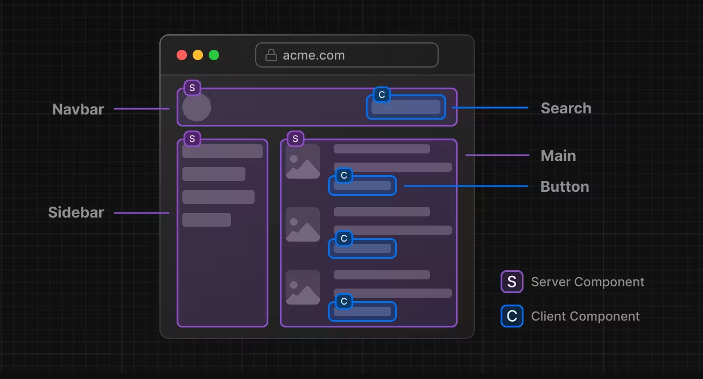
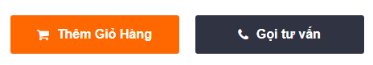

# ⭐ Components and Props

## 🔥 Component trong React là gì ?

- Trong React, "component" (thành phần) là một phần của giao diện người dùng được chia thành các phần nhỏ, có thể tái sử dụng và độc lập. Chúng giúp bạn chia nhỏ các phần phức tạp của ứng dụng thành các phần nhỏ hơn, dễ quản lý và tái sử dụng.

-React được xây dựng trên cơ sở của các thành phần. Mỗi thành phần là một đoạn mã JavaScript độc lập có thể nhận dữ liệu đầu vào và trả về một phần giao diện người dùng (UI) cụ thể. Khi dữ liệu đầu vào thay đổi, giao diện người dùng sẽ được cập nhật một cách tự động mà không cần phải thực hiện lại trang web.

- Chúng ta có thể xây dựng giao diện người dùng bằng cách kết hợp các Component lại với nhau
- Có 2 loại component là Function Component và Class Component.

Doc:

- <https://react.dev/learn/your-first-component>
- <https://www.w3schools.com/REACT/react_components.asp>

**Thinking in React:** <https://react.dev/learn/thinking-in-react>

> Component trong React chúng ta hướng tới đó là một thành phẩn nhỏ, một block UI

> Bất kỳ một thành phẩn UI nào hiển thị ra màn hình đều có thể là một Component




Ví dụ thực tế Components: 5.Demo-Projects\product.html

---

### 🔷 Cách định nghĩa 1 component

Trong Demo trên chúng ta có các button Thêm giỏ hàng, Gọi tư vấn

Thử tạo 2 button đó trong React

Trong file App.tsx bạn thêm đoạn code sau

```js
//Định nghĩa một component
function ButtonAddToCart() {
  return <button type="button">Thêm giỏ hàng</button>;
}
```

Hoặc các bạn thấy trên thanh Navigations có các liên kết bằng thẻ `a`

Thì trong React nó có thể được viết thành một Component

```js
function LinkHome() {
  return <a href="home">Home</a>;
}
```

Hoặc một ví dụ khác: Hình đại diện bài viết có thể được viết thành một component

```js
function ArticleThumbnail() {
  return (
    <div>
      
    </div>
  );
}
```

Kết luận: Với cách định nghĩa trên thì các bạn đã tạo ra được một function component trong React

---

### 🔷 Cách đặt tên một Component

Bắt buộc ký tự đầu tiên phải viết HOA theo kiểu Pascal Case (còn được gọi là Upper Camel Case)

Ví dụ: Profile, BlogDetails

---

### 🔷 Sử dụng một Component

```js
//App.js

// Sử dụng component Button
function App() {
  return (
    <section>
      <h1>Hello Components</h1>
      <Button />
    </section>
  );
}
export default App;
```

---

### 🔷 Các Components lồng vào nhau

Tạo thêm một Component ActionsButton

```js
function ActionsButton() {
  return (
    <div>
      <Button />
      <Button />
    </div>
  );
}
```

App.js sửa lại như sau:

```js
function App() {
  return (
    <section>
      <h1>Hello Components</h1>
      <ActionsButton />
    </section>
  );
}
export default App;
```

### 🔷 Import và Export Components

React nổi bật với việc tái sử dụng, do vậy bạn nên chia nhỏ thành nhiều các component.

Để làm được vậy bạn cần tạo ra một file .js hoặc .jsx, .ts và đặt code của component vào trong đó.

Theo convension bạn nên tạo ra một folder tên là components bên trong src.

Ví dụ: Tạo một một file src/components/ButtonAddToCart.js (tên file bằng tên Component)

```js
function ButtonAddToCart() {
  return <button type="button">Thêm giỏ hàng</button>;
}
//ES6 syntax
export default ButtonAddToCart;
```

Bây giờ tại component muốn sử dụng lại Car.js thì import vào

```js
import React from "react";
//ES6 import
import ButtonAddToCart from "./ButtonAddToCart.js";

function App() {
  return (
    <>
      <h1>Hello React Components</h1>
      <ButtonAddToCart />
    </>
  );
}
```

---

## 🔥 Khi nào thì cần tạo một Component ?

- Một tính năng, thành phần lặp đi lặp lại và nhận thấy có thể tái sử dụng

Ví dụ:

> Cùng kiểu dáng Chỉ khác nhau màu nền, màu chữ, icon



=> Ta chỉ cần tạo ra 1 component và tái sử dụng cho all các trường hợp

- Một thành phần có thể chạy độc lập, mà bạn chỉ muốn nó re-Render lại khi cần thiết.

- Một thành phần thường xuyên thay đổi nội dung.

## 🔥 Cú Pháp JSX ?

Cách mà làm cho Component trở nên Dynamic hơn

Xem [Giới thiệu về JSX](2.1.Introducing-JSX.md)
