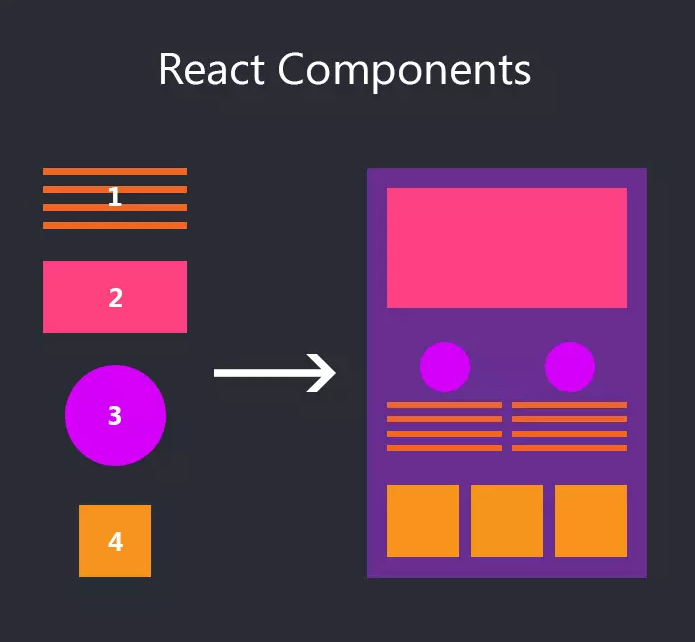
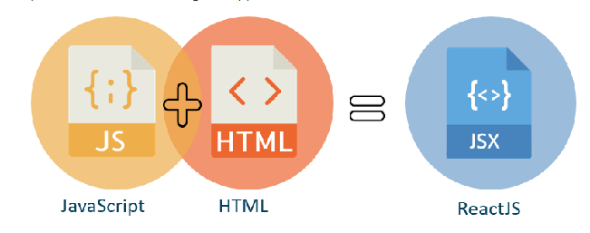

# Session 02 - JSX, Components

## 🔥 Component trong React là gì ?

- Trong React, "component" (thành phần) là một phần của giao diện người dùng được chia thành các phần nhỏ, có thể tái sử dụng và độc lập. Chúng giúp bạn chia nhỏ các phần phức tạp của ứng dụng thành các phần nhỏ hơn, dễ quản lý và tái sử dụng.

- React được xây dựng trên cơ sở của các thành phần. Mỗi thành phần là một đoạn mã JavaScript độc lập có thể nhận dữ liệu đầu vào và trả về một phần giao diện người dùng (UI) cụ thể. Khi dữ liệu đầu vào thay đổi, giao diện người dùng sẽ được cập nhật một cách tự động mà không cần phải thực hiện lại trang web.

- Chúng ta có thể xây dựng giao diện người dùng bằng cách kết hợp các Component lại với nhau
- Có 2 loại component là Function Component và Class Component.

Doc:

- <https://react.dev/learn/your-first-component>
- <https://www.w3schools.com/REACT/react_components.asp>

**Thinking in React:** <https://react.dev/learn/thinking-in-react>

> Component trong React chúng ta hướng tới đó là một thành phẩn nhỏ, một block UI

> Bất kỳ một thành phẩn UI nào hiển thị ra màn hình đều có thể là một Component




Ví dụ thực tế Components: 5.Demo-Projects\product.html

---

### 🔷 Cách định nghĩa 1 component

Trong Demo trên chúng ta có các button Thêm giỏ hàng, Gọi tư vấn

Thử tạo 2 button đó trong React

Trong file `App.tsx` bạn thêm đoạn code sau

```js
/* 
- Định nghĩa 1 hàm bắt đầu với kí tự HOA
- React hiểu là bạn đang định nghĩa một component 
*/
function ButtonAddToCart() {
  return <button type="button">Thêm giỏ hàng</button>;
}
```

Hoặc các bạn thấy trên thanh Navigations có các liên kết bằng thẻ `a`

Thì trong React nó có thể được viết thành một Component

```js
function LinkHome() {
  return <a href="home">Home</a>;
}
```

Hoặc một ví dụ khác: Hình đại diện bài viết có thể được viết thành một component

```js
function ArticleThumbnail() {
  return (
    <div>
      
    </div>
  );
}
```

Kết luận: Với cách định nghĩa trên thì các bạn đã tạo ra được một function component trong React

Ngoài cách định nghĩa bên trong một file `.tsx`. Bạn có thể tách nó ra thành một file component độc lập như kiểu bạn tạo một file .css (external)

Ví dụ như cấu trúc dưới đây.

```code
react-vite/
├─ src/
│  ├─ components/
│  │  ├─ Button.tsx
│  ├─ App.tsx
```

Compponent Button

```jsx
function Button() {
  return <button type="button">Button Default</button>;
}
export default Button;
```

Với cách làm này, bạn có thể tái sử dụng UI Button khắp mọi nơi cần đến.

---

### 🔷 Cách đặt tên một Component

Bắt buộc ký tự đầu tiên phải viết HOA theo kiểu Pascal Case (còn được gọi là Upper Camel Case)

Ví dụ: Profile, BlogDetails

---

### 🔷 Sử dụng một Component

```js
//App.js

// Sử dụng component Button
function App() {
  return (
    <section>
      <h1>Hello Components</h1>
      <Button />
    </section>
  );
}
export default App;
```

---

### 🔷 Các Components lồng vào nhau

Tạo thêm một Component ActionsButton

```js
function ActionsButton() {
  return (
    <div>
      <Button />
      <Button />
    </div>
  );
}
```

App.js sửa lại như sau:

```js
function App() {
  return (
    <section>
      <h1>Hello Components</h1>
      <ActionsButton />
    </section>
  );
}
export default App;
```

### 🔷 Import và Export Components

React nổi bật với việc tái sử dụng, do vậy bạn nên chia nhỏ thành nhiều các component.

Để làm được vậy bạn cần tạo ra một file .js hoặc .jsx, .ts và đặt code của component vào trong đó.

Theo convension bạn nên tạo ra một folder tên là components bên trong src.

Ví dụ: Tạo một một file src/components/ButtonAddToCart.tsx (tên file bằng tên Component)

```js
function ButtonAddToCart() {
  return <button type="button">Thêm giỏ hàng</button>;
}
//ES6 syntax
export default ButtonAddToCart;
```

Bây giờ tại component muốn sử dụng lại Car.js thì import vào

```js
import React from "react";
//ES6 import
import ButtonAddToCart from "./ButtonAddToCart";

function App() {
  return (
    <>
      <h1>Hello React Components</h1>
      <ButtonAddToCart />
    </>
  );
}
```

---

## 🔥 Khi nào thì cần tạo một Component ?

- Một tính năng, thành phần lặp đi lặp lại và nhận thấy có thể tái sử dụng

Ví dụ:

> Cùng kiểu dáng Chỉ khác nhau màu nền, màu chữ, icon


=> Ta chỉ cần tạo ra 1 component và tái sử dụng cho all các trường hợp

- Một thành phần có thể chạy độc lập, mà bạn chỉ muốn nó re-Render lại khi cần thiết.

- Một thành phần thường xuyên thay đổi nội dung.

---

## 🔥 Cú Pháp JSX ?

Cách mà làm cho Component trở nên hay ho hơn



### 🔷 JSX là gì ?

JSX là một cú pháp mở rộng cho JavaScript được sử dụng trong ReactJS để xây dựng giao diện người dùng.

JSX giúp chúng ta tạo ra các đối tượng React Element, mô tả cách giao diện người dùng sẽ được hiển thị. JSX kết hợp các thành phần React và HTML trong một cú pháp duy nhất, giúp mã nguồn trở nên dễ đọc và dễ hiểu hơn.

- JSX stands for JavaScript XML.

- JSX allows us to write HTML in React.

- JSX makes it easier to write and add HTML in React

- <https://www.w3schools.com/REACT/react_jsx.asp>
- <https://react.dev/learn/writing-markup-with-jsx>

### 🔷 Cách Code JSX

Để tạo ra một câu Hello world bằng HTML

```html
<h1 class="greeting">Hello, world!</h1>
```

Trong React bạn phải sử dụng phương thức JavaScript để tạo các phần tử HTML:

```js
//Without JSX
const myElement = React.createElement(
  "h1",
  { className: "greeting" },
  "Hello, world!"
);
const root = ReactDOM.createRoot(document.getElementById("root"));
root.render(myElement);
```

Cách viết này khá phức tạp và tồn thời gian để tạo ra một UI.
Thay vào đó người ta phát triển ra một thư viện giúp bạn đơn giản hóa hơn cách code đó là JSX.

JSX giúp bạn tạo ra các elements trong javascript như code bên HTML thuần túy

```javascript
//JSX
const myElement = <h1>I Love JSX!</h1>;

const root = ReactDOM.createRoot(document.getElementById("root"));
root.render(myElement);
```

### 🔷 Một số ưu điểm của JSX trong ReactJs

- Dễ đọc và dễ viết: Cú pháp giống HTML giúp viết các thành phần React một cách dễ dàng và tự nhiên.
- Tích hợp JavaScript: Có thể sử dụng các biểu thức JavaScript để tích hợp logic vào trong mã JSX.
- Tối ưu hóa mã: JSX giúp viết mã gọn gàng và tổ chức tốt hơn, dễ dàng bảo trì và phát triển

### 🔷 JSX làm được gì ?

#### 1. Đơn giản hóa việc code HTML trong JavaScript

```js
//html 1 dòng
const element = <h1 className="greeting">Hello, world!</h1>;
```

Chèn khối HTML lớn với nhiều dòng code. Bắt buộc phải bọc ngoài một thẻ CHA.

Bạn có thể sử dụng thẻ `<div>`

```js
const element = (
  <div>
    <h1>Hello!</h1>
    <h2>Good to see you here.</h2>
  </div>
);
```

Hoặc một thẻ fragment giống như một thẻ HTML trống `<></>`

```js
const element = (
  <>
    <h1>Hello!</h1>
    <h2>Good to see you here.</h2>
  </>
);
```

#### 2. Thực thi một biểu thức

Bạn có thể thực thi một biểu thức trong một cặp ngoặc nhón `{}`

Một biểu thức có thể là một biến React, một thuộc tính, hoặc bất kỳ biểu thức javascript hợp lệ khác. JSX sẽ thực thi và return lại kết quả.

```js
// Biến
const name = "John Smith";
const myelement = <h1>I am {name}</h1>;

// Biểu thức toán học
const myelement = <h1>React is {5 + 5} times better with JSX</h1>;

function greet() {
  return "Hello, world!";
}
//Gọi hàm
const myelement = <h1>{greet()}</h1>;

//Object
const info = {
  id: 1,
  name: "John",
  email: "john@example.com",
};
const myelement = (
  <ul>
    <li>{info.name}</li>
    <li>{info.email}</li>
  </ul>
);
```

#### 3. Đóng tất cả các thẻ

Các thẻ standalone như `` `<input>` thì buộc phải đóng lại như sau ``, `<input />`

```js
const myElement = <input type="text" />;
```

#### 4. Thuộc tính class đổi thành className

```js
const myElement = <h1 className="myclass">Hello World</h1>;
```

#### 5. Sử dụng cú pháp camelCase trong tất cả mọi trường hợp

- JSX Style:
  - background-image ==> backgroundImage
  - background-color ==> backgroundColor

```js
const myElement = (
  <h1
    style={{
      backgroundColor: "yellow",
      fontWeight: "bold",
    }}
  >
    Hello World
  </h1>
);
```

#### 6. Biểu thức điểu kiện if với JSX

React hỗ trợ câu lệnh `if` nhưng không phải trong JSX.

Do vậy để sử dụng `if` bạn có 2 cách:

Cách 1:

```javascript
const x = 5;
let text = "Goodbye";
if (x < 10) {
  text = "Hello";
}

const myElement = <h1>{text}</h1>;
```

Cách 2:

```javascript
const x = 5;

const myElement = <h1>{x < 10 ? "Hello" : "Goodbye"}</h1>;
```

### 🔷 4.Converting HTML to JSX

Html

```html
<h1>Hedy Lamarr's Todos</h1>

<ul>
  <li>Invent new traffic lights</li>
  <li>Rehearse a movie scene</li>
  <li>Improve the spectrum technology</li>
</ul>
```

JSX

```js
export default function TodoList() {
  return (
    // This doesn't quite work!
    <h1>Hedy Lamarr's Todos</h1>
    
    <ul>
      <li>Invent new traffic lights
      <li>Rehearse a movie scene
      <li>Improve the spectrum technology
    </ul>
  );
}
```

### 🔷 5. Comment strong JSX

```js
let elements =  (
    <div>
      <!-- This doesn't work! -->
      {/* A JSX comment */}


      {/*
        Multi
        line
        comment
      */}

    </div>
);

```

---

## 🔥 Thêm Css vào Dự Án

Trong React bạn sử dụng CSS class với tên là className. Nó giống như HTML class attribute:

```js


/* In your CSS */
.avatar {
  border-radius: 50%;
}

```

## 🌻 React Components Style Methods

### 🔥 1. CSS Stylesheet

Đơn giản là các bạn sẽ import file css vào component bằng cách

```js
import "./App.css";
```

Lưu ý: Nếu bạn import css vào trong file App thì css đó sẽ có tính toàn cục (tức tất cả mọi nơi đều có thể sử dụng)

### 🔥 2. Inline styling

Trong React, inline styles không được viết dưới dạng string (chuỗi) như html thông thường. Thay vào đó nó sẽ được viết dưới dạng Object với key được viết theo kiểu camelCased còn style của value sẽ thường là kiểu string.

```js
<div style={{ backgroundColor: "white", color: "red" }}>Hello</div>
```

Ngoài ra, chúng ta cũng có thể tạo một biến lưu trữ giá trị css rồi truyền nó vào các element như sau:

```js
const styleObject = {backgroundColor: 'white', color: 'red'}

<div style={styleObject}>Hello</div>
```

### 🔥 3. CSS Module ?

Giúp bạn tránh bị xung đột css

```js
    //Cách thực hiện: Tạo một file css có tên
    ComponentName.module.
    // đặt nó cùng với file component sử dụng nó
    /* Import  */
    import styles from "./ComponentName.module.scss";

    ...
    return (
        <div className={styles.container}>

        </div>
    );

```

## 🌻 Embed icon Font React

- React Icons <https://react-icons.github.io/react-icons>

```bash
npm i react-icons
yarn add react-icons
```

Usage:

```js
/*
Để lấy cùng lúc nhiều icon, thì cách nhau = dấu phẩy
*/
import { FaBeer, FaHeart } from 'react-icons/fa';

function MyComponent() {
  render() {
    return <h3> Lets go for a <FaBeer />? I am Love  <FaHeart /> Beer </h3>
  }
}
```

- Font Awesome: <https://docs.fontawesome.com/web/use-with/react/>

## 🌻 Chèn hình vào React

Trong cấu trúc của react vite bạn có thể lưu trữ hình ảnh vào 2 nơi

```code
react-vite/
├─ public/
│  ├─ images/
│     ├── ten-hinh.png
├─ src/
│  ├─ assets/
│     ├── ten-hinh.png
```

- 1 là trong thư mục public
- 2 là trong src/assets/

Với cách 1 thì trong các components bạn chỉ cần dẫn đường dẫn như sau:

```jsx

```

Khi ứng dụng chạy thì thư mục public là thư mục gốc

Với cách 2 bạn cần import

```jsx
//App.tsx
import images from "./assets/ten-hinh.png";
;
```

Nếu sử dụng với React Vite không cấu hình thư mục public bạn cần cấu hình thêm `vite.config.ts`

```ts
//Sửa hàm defineConfig thành như sau
export default defineConfig({
  root: "./",
  build: {
    outDir: "dist",
  },
  publicDir: "public",
  plugins: [react()],
});
```

## 🌻 Hướng dẫn nhúng font vào React App

### 1. Nhúng Font Local

#### Bước 1: Chuẩn bị file font

- Tải các file font bạn muốn sử dụng (thường là `.ttf`, `.woff`, hoặc `.woff2`).
- Lưu file font vào thư mục dự án, ví dụ: `src/assets/fonts`.

#### Bước 2: Khai báo font trong CSS

- Tạo file CSS (hoặc SCSS) trong dự án, ví dụ: `src/styles/fonts.css`.
- Sử dụng `@font-face` để khai báo font:

```css
@font-face {
  font-family: "CustomFont";
  src: url("../assets/fonts/custom-font.woff2") format("woff2"), url("../assets/fonts/custom-font.woff")
      format("woff");
  font-weight: normal;
  font-style: normal;
}
```

#### Bước 3: Import file CSS vào ứng dụng

- Mở file `src/index.js` hoặc `src/index.tsx` và import file CSS:

```javascript
import "./styles/fonts.css";
```

#### Bước 4: Sử dụng font trong ứng dụng

- Áp dụng font trong CSS:

```css
body {
  font-family: "CustomFont", sans-serif;
}
```

### 2. Nhúng Google Font

#### Bước 1: Lấy link Google Font

- Truy cập [Google Fonts](https://fonts.google.com/), chọn font bạn muốn, và sao chép URL embed:

```html
<link
  href="https://fonts.googleapis.com/css2?family=Roboto:wght@400;700&display=swap"
  rel="stylesheet"
/>
```

#### Bước 2: Nhúng Google Font vào dự án

Có hai cách để nhúng Google Font:

**Cách 1: Nhúng vào file `public/index.html`**

- Mở file `public/index.html` và thêm thẻ `<link>` trong phần `<head>`:

```html
<!DOCTYPE html>
<html lang="en">
  <head>
    <meta charset="UTF-8" />
    <link
      href="https://fonts.googleapis.com/css2?family=Roboto:wght@400;700&display=swap"
      rel="stylesheet"
    />
    <title>React App</title>
  </head>
  <body>
    <div id="root"></div>
  </body>
</html>
```

**Cách 2: Import vào file CSS**

- Thêm link Google Font vào file CSS (hoặc SCSS) của bạn:

```css
@import url("https://fonts.googleapis.com/css2?family=Roboto:wght@400;700&display=swap");

body {
  font-family: "Roboto", sans-serif;
}
```

#### Bước 3: Sử dụng font trong ứng dụng

- Dùng font đã khai báo:

```css
/* App.css */
h1 {
  font-family: "Roboto", sans-serif;
}
```
