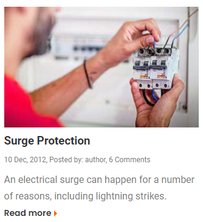
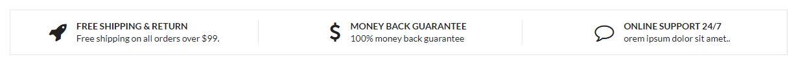

# Thực hành Session 02

## Task 1

Tạo một Component : Hiển thị ra mành hình chữ "Hello World"

## Task 2

- Tạo một Component : Hiển thị ra mành hình Button: Thêm vào giỏ hàng
- Tạo một Component : Hiển thị ra mành hình Button: Gọi lại tư vấn

## Task 3

- Tạo một Component : Hiển thị ra màn hình một hình ảnh

## Task 4

Tạo một Component:

- Trong component đó định nghĩa các biến: name = Tên của bạn, age = Tuổi của bạn
- Dùng các biến trên, đưa vào phần `return` của Component.

## Task 5

- Tạo một UI như hình (Lưu ý:Chưa áp áp dụng Css)

  

## Task 6

Tạo ra một component chứa tất cả các component đã tạo từ Task 1 - 4

## Task 7

Tại một UI như hình

## Task 8

Nâng cấp task 2, thêm icon vào để có được như hình

