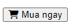

# Thực hành Session 02

## Task 1

Tạo một Component : Hiển thị ra mành hình chữ "Hello World"

## Task 2

- Tạo một Component : Hiển thị ra màn hình một hình ảnh

## Task 3

Tạo một Component : Hiển thị ra mành hình chữ "Đồng hồ MVW 44 mm Nam MSC003-02" trong một thẻ h3

## Task 4

Tạo một Component:

- Trong component đó định nghĩa các biến: price = giá niêm yết, promoPrice = giá khuyến mãi.
- Dùng các biến trên, đưa vào phần `return` của Component để được như hình sau:

## Task 5

Tạo một Component : Hiển thị ra mành hình Button: Mua ngay

## Task 6

Tạo component như sau

