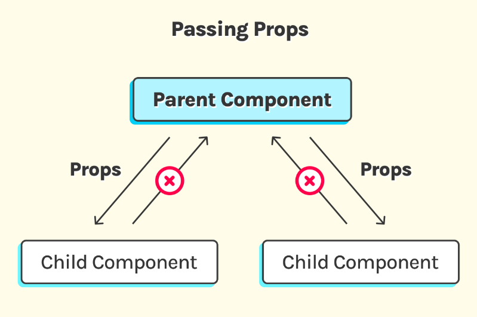

# Props

## 🔥 Props là gì ?

- Props là các tham số được truyền vào một React components.
- Props có thể sử dụng như là một HTML attribute

### 🌻 Tại sao lại cần đến Props?

Để trả lời câu hỏi này chúng ta cùng tạo ra 2 button trên như sau:

```js
function ButtonAddToCart() {
  return <button type="button">Thêm giỏ hàng</button>;
}
function ButtonCall() {
  return <button type="button">Gọi tư vấn</button>;
}
```

Với kiến thức đã học trên thì bạn tạo ra 2 button trên với cách code như vậy.

Tuy nhiên nó mất đi cái đặc tính nổi bật của component là TÁI SỬ DỤNG.

Bạn nhận thấy rằng 2 button trên hoàn toàn giống nhau, nó chỉ khác phần `label` tên hiển thị.

Thì chính lúc này ta cần đến một biến mà trong React gọi là `props`

Chúng ta chỉ cần tạo ra 1 component

```js
//Button nhận vào một tham số có tên mặc định trong React là props ==> nó là một object
function Button(props) {
  return <button type="button">{props.label}</button>;
}
```

Khi đó để tạo ra 2 button như demo thì trong App.tsx

```js
function App() {
  return (
    <>
      <h1>Hello React Components</h1>
      <Button label="Thêm giỏ hàng" />
      <Button label="Gọi Tư Vấn" />
    </>
  );
}
```

Trên đây ta sử dụng thuộc tính label='' thì React nó tự động thêm vào `props` một phần tử có key là `label` và value là giá trị trong dấu `=`

Khi đó trong component Button chúng ta truy cập tới giá phần từ `label` để lấy giá trị của nó `props.label` như object bình thường.

---

### 🌻 Truyền Props cho một Component

React components sử dụng các props để giao tiếp với nhau. Component CHA cần truyền thông tin đến component CON bằng cách sử dụng props.



⚠️ LƯU Ý:

- Bạn chỉ được TRUYỀN dữ liệu từ CHA --> CON được biết đến với thuật ngữ `one-way data binding` (ràng buộc dữ liệu một chiều). Và không thể TRUYỀN theo hướng ngược lại.
- Nếu component con muốn "gửi" thông tin ngược lại cho component cha, bạn cần sử dụng các callback functions hoặc sự kiện để truyền dữ liệu ngược lại thông qua các props, nhưng chính bản thân dữ liệu thì chỉ đi theo hướng từ cha sang con.

Props sử dụng như HTML attributes, nhưng bạn có thể truyền bất kỳ giá trị JavaScript thông qua chúng, bao gồm cả objects, arrays, và functions

Lấy lại ví dụ trên các bạn có thể thêm cho nó nhiều thuộc tính khác:

```jsx
//Component CON
function ChildComponent(props) {
  return <button type="button">{props.label}</button>;
}
//Component CHA
function ParentComponent() {
  /**
   * CHA có dữ liệu cần truyền xuống cho CON
   */
  const fontSize = 18; //number
  const bgColor = "#ff6700"; // string
  const label = "Thêm vào giỏ hàng"; //string
  const myCustomStyle = {
    fontWeight: "bold",
    textTransform: "uppercase",
  }; //object

  const handleClick = () => {
    console.log("you clicked");
  }; // arrow function

  return (
    <>
      <h1>Hello React Components</h1>

      <ChildComponent
        onClick={handeClick}
        fontSize={fontSize}
        bgColor={bgColor}
        label={label}
        customStyle={myCustomStyle}
      />
    </>
  );
}
```

Chúng ta nhận thấy Component Button nhận vào tham số `props`.

Bên trong thân nó chúng ta không hình dung được là nó đang có những thuộc tính nào để mà sử dụng.

Làm sao biết có label để `props.label` ?

Khi đó chúng ta có một cách biết khác TƯỜNG MINH hơn bằng cách sử dụng cú pháp `ES6 Destructuring` như sau

Xem bài viết React ES6 Destructuring: https://www.w3schools.com/react/react_es6_destructuring.asp

```js
//Cú pháp Destructuring một Object
//props = {label, fontSize, bgColor, customStyle}
//{label, fontSize, bgColor, customStyle} = props
function Button({ label, fontSize, bgColor, customStyle }) {
  return <button type="button">{props.label}</button>;
}
```

---

### 🌻 Cách truyền dữ liệu ngược từ CON --> CHA

Nếu bạn muốn gửi dữ liệu từ CON ra cho CHA bạn có thể sử dụng `callback function`

```jsx
/**
 * Con nhận vào một callback function
 * dưới dạng một phần tử của props
 */
const Child = ({ onMessageChange }) => {
  const sendMessageToParent = () => {
    const message = "Hello from Child!";
    // Dùng hàm từ CHA truyền vào để gửi thông tin (message) từ CON ra cho CHA
    onMessageChange(message);
  };

  return (
    <div>
      <h2>Child Component</h2>
      <button onClick={sendMessageToParent}>Send Message to Parent</button>
    </div>
  );
};

const Parent = () => {
  // Hàm này sẽ nhận dữ liệu message từ con
  const handleMessageChange = (message) => {
    console.log("Message from Child:", message);
  };

  return (
    <div>
      <h1>Parent Component</h1>
      {/* Truyền hàm xuống component con qua props */}
      <Child onMessageChange={handleMessageChange} />
    </div>
  );
};
```

---

### 🌻 Default Props

`defaultProps` được ngưng sử dụng từ React 18.3.1.

Thay vào đó bạn có thể đặt giá trị mặc định cho props như sau:

```ts
function Button({ label = "Default" }: { label?: string }) {
  return <button type="button">{label}</button>;
}
```

---

### 🌻 Props Children

Bạn có thể lồng các component vào với nhau giống như các thẻ HTML vậy, điều đó làm cho JSX trông giống với HTML. Và các component hay nội dung được lồng ở trong các component được gọi là children

**Child component**

```js
<Dad>
  <Son />
  <Son />
  <Son />
</Dad>
```

Ở đây ta có 3 component `<Son />`, chúng sẽ là props.children của component `<Dad />`

Khi đó `<Dad />` sẽ trong như thế này

```js
function Dad(props){
  return (
    <div>
      {props.children}
    <div>
  )
}
//hoặc
function Dad({children}){
  return (
    <div>
      {children}
    <div>
  )
}
```

**Everything can be a child**

Children trong React thì không nhất thiết phải là cái gì, nó có thể là 1 component hay nhiều component, 1 thẻ h1 hoặc nhiều thẻ h1, 1 chữ hoặc nhiều chữ...

```js
<Dad>
  <h1>Hello Children</h1>
</Dad>
```

Bạn chỉ cần nhớ một điều:

Children là phần nội dung lòng vào giữa một component.

---

===============================

### 🌻 Props với TypeScript

Để code Props với cú pháp của TypeScript bạn làm như ví dụ sau:

```jsx
/**
 * Đơn giản là bạn định hình kiểu dữ liệu cho các thuộc tính của props
 */
type TButton = {
  label: string;
  fontSize: stringl
  bgColor: string;
  customStyle: {}
}
function Button({ label, fontSize, bgColor, customStyle } : TButton) {
  return <button type="button">{props.label}</button>;
}
```

Tham khảo sử dụng Prop với TypeScript

- <https://github.com/typescript-cheatsheets/react#basic-prop-types-examples>

- <https://cinthialandia.com/blog/props/>
