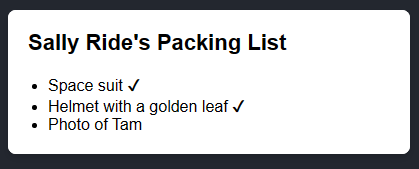
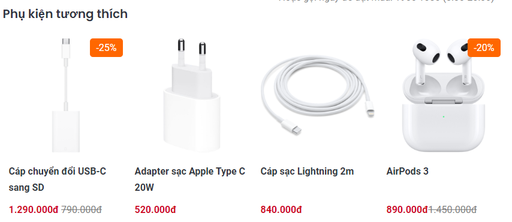

# ⭐ Session 4 - Conditional Rendering

**Conditional Rendering** trong React là quá trình hiển thị các thành phần (components) hoặc phần tử (elements) dựa trên một điều kiện nhất định. Điều này tương tự như cách bạn sử dụng câu lệnh điều kiện như `if` hoặc toán tử `ternary` trong JavaScript để quyết định logic nào sẽ chạy.

Trong React, bạn có thể sử dụng conditional rendering để kiểm soát xem phần tử nào sẽ được hiển thị trên giao diện người dùng (UI) tùy theo trạng thái (state) hoặc props.

Ví dụ minh họa

```jsx
const App = () => {
  /* Bạn có 1 biến isShow như sau */
  const isShow = false;

  return (
    <div>
      <h1>Conditional Rendering</h1>
      {/* Bạn muốn button này chỉ hiển thị ra khi biến isShow = true */}
      <button>Button</button>
    </div>
  );
};
```

Điều này có nghĩa là element/Component button cần có `điều kiện cần đáp ứng` để mới được hiển thị.

Khi đó bạn có thể code lại như sau:

```jsx
const App = () => {
  /* Bạn có 1 biến isShow như sau */
  const isShow = false;

  return (
    <div>
      <h1>Conditional Rendering</h1>
      {/* Bạn muốn button này chỉ hiển thị ra khi biến isShow = true */}
      {isShow === true ? <button>Button</button> : null}
    </div>
  );
};
```

Để một thành phần UI hiển thị hay không hiển thị thì có nhiều cách code. Cùng xem phần tiếp theo.

## 🔥 Một số cách phổ biến để thực hiện conditional rendering trong React:

Ví dụ minh họa



Tạo một component để thực hiện ví dụ trên.

## 🔥 Điều kiện `if` trả về biểu thức `JSX`

```js
//App.jsx

function Item({ name, isPacked }: { name: string, isPacked: boolean }) {
  if (isPacked) {
    //returning JSX
    return <li className="item">{name} ✔</li>;
  }
  //returning JSX
  return <li className="item">{name}</li>;
}

export default function PackingList() {
  return (
    <section>
      <h1>Sally Ride's Packing List</h1>
      <ul>
        <Item isPacked={true} name="Space suit" />
        <Item isPacked={true} name="Helmet with a golden leaf" />
        <Item isPacked={false} name="Photo of Tam" />
      </ul>
    </section>
  );
}
```

## 🔥 Điều kiện trả về không có gì với `null`

```js
function Item({ name, isPacked } : {name: string, isPacked: boolean}) {
   // If isPacked is true, the component will return nothing, null
  if (isPacked) {
    return null;
  }
  return <li className="item">{name}</li>;
}
....

```

## 🔥 Điều kiện toán tử ngôi thứ 3 (? :)

```js
 ...

function Item({ name, isPacked } : {name: string, isPacked: boolean}) {
  return (
    <li className="item">
      {isPacked ? name + ' ✔' : name}
    </li>
  );
}
...
```

## 🔥 Logical AND operator (&&)

```js
...

function Item({ name, isPacked } : {name: string, isPacked: boolean}) {
  return (
    <li className="item">
      {name} {isPacked && '✔'}
    </li>
  );
}
...

```

## 🔥 Điều kiện gán một JSX như là một biến

```js
function Item({ name, isPacked }: { name: string, isPacked: boolean }) {
  let itemContent = name;
  if (isPacked) {
    itemContent = name + " ✔";
  }
  return <li className="item">{itemContent}</li>;
}
```

Ví dụ thực tế:

Chỉ có sản phẩm đầu và cuối là hiển thị discount. Vậy điều kiện nào để nó mới thiển thị ?


