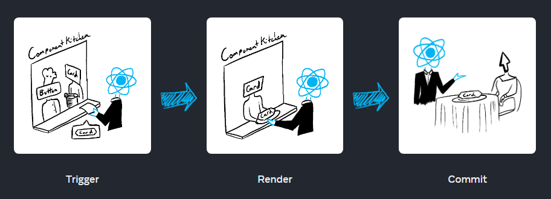
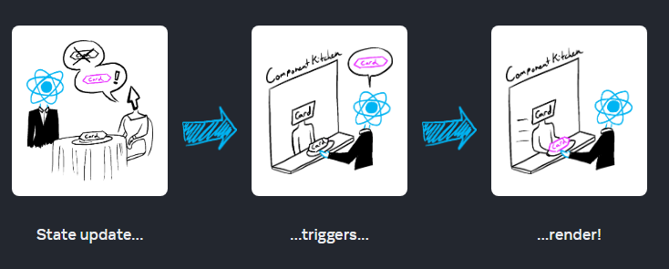

# ⭐ State and Lifecycle

Trong Session này chúng ta tìm hiểu:

===============================

✅ State là gì ?

✅ Khái niệm One-Way / Two-way binding

✅ State và Lifecycle

✅ Cách Update một State

===============================

## 🔥 5.1 Khái niệm State trong React

- State là một đối tượng lưu trữ dữ liệu hoặc thông tin có thể thay đổi trong vòng đời của một component.
- Mỗi component trong React có thể quản lý riêng state của nó, và khi state thay đổi, component sẽ tự động re-render để hiển thị lại nội dung mới.

### 🌻Tại sao lại cần đến State ?

- **Phản hồi theo sự thay đổi:** State cho phép React theo dõi sự thay đổi của dữ liệu và tự động cập nhật giao diện tương ứng.

- **Quản lý thông tin động:** Các thông tin như nhập liệu, click button, dữ liệu từ API đều có thể được lưu trữ và quản lý qua state.

Cùng xem một ví dụ minh họa để thấy sự cần thiết State.

```js
export default function Count() {
  let count = 0;

  function handleClick() {
    count = count + 1;
  }
  return (
    <>
      <div>
        <p>Bạn đã bấm {count} lần</p>
        <button onClick={handleClick}>Tăng</button>
      </div>
    </>
  );
}
```

==> Biến count không thể tăng lên như mong muốn.

### 🌻Khởi tạo một State

Ví dụ có biến count, và một button, khi click Button thì biến count tăng lên 1 giá trị.

```js
import React, { useState } from "react";

function Counter() {
  // Khai báo state: count, hàm setCount
  const [count, setCount] = useState(0);

  return (
    <div>
      <p>Bạn đã bấm {count} lần</p>
      <button onClick={() => setCount(count + 1)}>Bấm tôi</button>
    </div>
  );
}
```

Cú pháp tạo một State

```js
//const [stateName, setStateName] = React.useState(initialState);
const [count, setCount] = React.useState(0);
```

Giải thích:

- Bản chất `React.useState(0)` là một function return về một mảng [] có 2 phần tử. Tạo ra một state với giá trị ban đầu là `0`

- `[count, setCount]` là đang sử dụng cú pháp `Destructuring assignment` của JavaScript

- `count`: Biến lưu trữ giá trị hiện tại của state
- `setCount`: Hàm để cập nhật giá trị của `count`.
- Mỗi khi `setCount` được gọi, component sẽ được re-render với giá trị `count` mới

### 🌻Khi nào thì cần đến State

Bất cứ khi nào dữ liệu thay đổi trong một component, State có thể được sử dụng.

- ví dụ: Từ ẩn sang hiện, từ không có thành có... Nói chung là trạng thái lúc đầu khác với lúc sau
- Ví dụ: một form nhập input type text mỗi trường trong Form sẽ giữ lại trạng thái của nó dựa trên dữ liệu đầu vào của người dùng (user input). Nếu đầu vào của người dùng thay đổi, trạng thái của các text input sẽ thay đổi, đây là nguyên nhân cần re-rendering của component và tất cả các component con của nó. Và khi này chúng ta sẽ sử dụng state

### 🌻 State hoạt động như thế nào ?

Trong React, state (trạng thái) là một đối tượng chứa thông tin dữ liệu và trạng thái của một thành phần (component).

State được sử dụng để lưu trữ và quản lý dữ liệu trong function component. State có thể là bất kỳ kiểu dữ liệu nào, bao gồm cả số, chuỗi, mảng, đối tượng hoặc các giá trị boolean.

Khi state thay đổi, React sẽ tự động render lại giao diện người dùng của thành phần để phản ánh các thay đổi mới. Tức là, React sẽ so sánh giá trị cũ và giá trị mới của state và chỉ cập nhật những phần cần thiết của giao diện người dùng.

Để thay đổi giá trị của state, bạn cần sử dụng phương thức setState(). Phương thức này được cung cấp bởi React và cho phép bạn cập nhật giá trị của state và kích hoạt quá trình render lại giao diện người dùng. Khi gọi setState(), React sẽ thực hiện quá trình so sánh và cập nhật giao diện người dùng nếu cần.

===============================

### 🌻 Ví dụ về State

#### 🎁 Button Like

Dưới đây là ví dụ cập nhật về **Button Like**, trong đó khi người dùng nhấn "Like", số lượng like sẽ tăng lên và màu chữ của nút sẽ thay đổi.

### Code ví dụ:

```jsx
import React, { useState } from "react";

function LikeButton() {
  const [likeCount, setLikeCount] = useState(0);
  const [isLiked, setIsLiked] = useState(false);

  // Hàm xử lý sự kiện khi người dùng nhấn nút "Like"
  const handleLike = () => {
    setLikeCount(likeCount + 1);
    setIsLiked(true); // Đánh dấu rằng đã nhấn Like
  };

  return (
    <div>
      <button
        onClick={handleLike}
        style={{ color: isLiked ? "red" : "black" }} // Đổi màu chữ
      >
        Like ({likeCount})
      </button>
    </div>
  );
}

export default LikeButton;
```

### Giải thích:

1. **useState**:
   - `likeCount`: lưu trữ số lượng like.
   - `isLiked`: lưu trữ trạng thái liệu người dùng đã nhấn nút like hay chưa.
2. **handleLike**: Khi người dùng nhấn nút, hàm này sẽ:

   - Tăng giá trị `likeCount` lên 1.
   - Đặt `isLiked` thành `true` để thay đổi màu chữ.

3. **style**: Sử dụng thuộc tính `style` để kiểm tra trạng thái `isLiked`. Nếu `isLiked` là `true`, màu chữ của nút sẽ chuyển sang **màu đỏ**, ngược lại sẽ giữ **màu đen**.

#### 🎁 Button Đèn Xanh, Đèn Đỏ

Dưới đây là ví dụ **mô phỏng đèn giao thông** với 3 nút để đổi màu thành **Đỏ**, **Xanh**, và **Vàng**:

### Code ví dụ:

```jsx
import React, { useState } from "react";

function TrafficLight() {
  // State để theo dõi trạng thái của đèn (đỏ, xanh, vàng)
  const [lightColor, setLightColor] = useState("red");

  // Hàm thay đổi màu đèn
  const changeLight = (color) => {
    setLightColor(color);
  };

  return (
    <div style={{ textAlign: "center", marginTop: "50px" }}>
      <div
        style={{
          width: "100px",
          height: "100px",
          borderRadius: "50%",
          backgroundColor: lightColor, // Đổi màu đèn theo state
          margin: "0 auto",
          transition: "background-color 0.5s ease", // Hiệu ứng chuyển đổi mượt mà
        }}
      ></div>

      {/* Các nút để thay đổi trạng thái của đèn */}
      <div style={{ marginTop: "20px" }}>
        <button
          onClick={() => changeLight("red")}
          style={{ marginRight: "10px" }}
        >
          Red
        </button>
        <button
          onClick={() => changeLight("yellow")}
          style={{ marginRight: "10px" }}
        >
          Yellow
        </button>
        <button onClick={() => changeLight("green")}>Green</button>
      </div>
    </div>
  );
}

export default TrafficLight;
```

### Giải thích:

1. **useState**: State `lightColor` được sử dụng để lưu màu hiện tại của đèn. Ban đầu, nó có giá trị là `'red'`.
2. **changeLight**: Hàm này được gọi khi người dùng nhấn một trong ba nút. Mỗi nút sẽ truyền vào một giá trị màu khác nhau (`'red'`, `'yellow'`, `'green'`) để thay đổi màu của đèn.

3. **style**:

   - `backgroundColor`: Đèn sẽ đổi màu theo giá trị `lightColor`.
   - `transition`: Thêm hiệu ứng mượt mà khi chuyển đổi giữa các màu đèn.

4. **button**: Có 3 nút, mỗi nút tương ứng với một màu (Đỏ, Vàng, Xanh). Khi nhấn vào các nút, hàm `changeLight` sẽ thay đổi màu của đèn dựa trên màu tương ứng của nút.

Với ví dụ này, bạn có thể dễ dàng chuyển đổi qua lại giữa 3 màu **Đỏ**, **Vàng**, và **Xanh** bằng cách nhấn vào các nút.

#### 🎁 Modal open/close

```jsx
const App = () => {
  const [isShow, setIsShow] = useState(false);

  const handleModal = () => {
    setIsShow(!isShow);
  };

  return (
    <div>
      <h1>Simple Modal</h1>
      <button onClick={handleModal}>Toogle Modal</button>
      {isShow && <div className="modal">This is a Modal</div>}
    </div>
  );
};
```

#### 🎁 Simple todo list

```js
import React, { useState } from "react";

const ListExample = () => {
  const [items, setItems] = useState([
    { id: 1, text: "Mua sữa" },
    { id: 2, text: "Đi chợ" },
    { id: 3, text: "Làm bài tập" },
  ]);

  const handleAddItem = () => {
    const newItem = { id: items.length + 1, text: "Việc mới" };
    setItems([...items, newItem]);
  };

  const handleRemoveItem = (id) => {
    const updatedItems = items.filter((item) => item.id !== id);
    setItems(updatedItems);
  };

  return (
    <div>
      <ul>
        {items.map((item) => (
          <li key={item.id}>
            {item.text}
            <button onClick={() => handleRemoveItem(item.id)}>Xóa</button>
          </li>
        ))}
      </ul>
      <button onClick={handleAddItem}>Thêm việc mới</button>
    </div>
  );
};

export default ListExample;
```

## 🔥 5.2 Một Component có thể dùng nhiều State

Trong một component bạn có thể sử dụng nhiều State để quản lý thay đổi UI trên component đó.

Sau đây là một ví dụ:

```jsx
import React, { useState } from "react";

function HelloCount() {
  // State cho count
  const [count, setCount] = useState(0);
  // State cho việc hiển thị count
  const [isShow, setIsShow] = useState(false);
  //Và có thể State sau phụ thuộc vào State trước
  return (
    <div>
      <h1>HelloCount</h1>
      {isShow && (
        <div className="section_count">
          <p>
            Count: <strong>{count}</strong>
          </p>
          <button onClick={() => setCount(count + 1)}>+ 1</button>
        </div>
      )}
      <button onClick={() => setIsShow(!isShow)}>Toogle Count</button>
    </div>
  );
}

export default HelloCount;
```

## 🔥 5.3 State là cô lập và cục bộ

State là một trạng thái cục bộ và cô lập cho một phiên bản (instance) trên một mành hình UI.

Nói cách khác. Nếu bạn `render` 2 lần một component, thì mỗi bản sao sẽ có trạng thái cô lập hoàn toàn, có nghĩa là thay đổi trạng thái của một trong số chúng thì cái kia không ảnh hưởng.

```jsx
//Dùng component HelloCount 2 lần
const App = () => {
  return (
    <>
      <h1>Hello State</h1>
      <HelloCount /> {/*  bản sao 1 */}
      <HelloCount /> {/*  bản sao 2 */}
    </>
  );
};
export default App;
```

## 🔥 5.4 Khái niệm Lifecycle

🌻 **Re-Render trong React là gì?**

Khi nói về Performances của React, có 2 giai đoạn chính mà chúng ta cần quan tâm:

- **initial render** : Khởi chạy App, React gọi Root Component bằng cách gọi `createRoot` tạo DOM và chạy hàm `render` để render component hiển thị ra màn hình.

- **Re-render** Xảy ra khi React cần update App một số giá trị mới. Thông thường, điều này xảy ra do người dùng tương tác với ứng dụng (events handling) hoặc một số dữ liệu bên ngoài đến thông qua một yêu cầu bất đồng bộ ví dụ như call API lấy data đổ về.

===============================

🌻 **Khi nào và tại sao một component render ?**

Có 2 lí do để 1 component render:

1. Render lần đầu tiên (initial render)

2. State của component hoặc component CHA của nó thay đổi.

===============================

🌻 **LifeCycle**

Quá trình xử lý yêu cầu tương tác từ giao diện người dùng có 3 bước:

1. Triggering a render (nhận yêu cầu Order từ khách đưa cho nhà bếp)

2. Rendering the component (nhà bếp chuẩn bị Order)

3. Committing to the DOM (Mang món ra bàn cho khách)



Chu trình này trong React Component còn được hiểu với một khái niệm đó là **LifeCycle** - Vòng đời của một Component.

- Component được sinh ra - Gọi món (**Mounting**)
- Component tồn tại và thay đổi - Chuẩn bị Món (**Updation**)
- Component mất đi - Mang món ra cho khách (**Unmounting**)

---

Xem thêm mô hình LifeCycle đối với Class Components: <https://projects.wojtekmaj.pl/react-lifecycle-methods-diagram/>

Xem ví dụ minh họa

Chúng ta sẽ tìm hiểu kỹ hơn các khái niệm này trong bài học về Hook useEffect. Trecking một component để biết khi nào thì nó **Mounting**, khi nào thi nó **Updation**, và khi nào thì nó đã **Unmounting**

Đọc thêm bài viết: <https://viblo.asia/p/lifecycle-component-trong-reactjs-gGJ59jzxKX2>

---

QUY TRÌNH 1 COMPONENT RENDER:

🔸**Step 1: Kích hoạt render**

- Initial render

Khởi chạy App, React gọi Root Component bằng cách gọi createRoot tạo DOM và chạy hàm render để render component hiển thị ra màn hình.

Example:

```js
import Image from "./Image.js";
import { createRoot } from "react-dom/client";

const root = createRoot(document.getElementById("root"));
root.render(<Image />);
```

- State update

Một component đã được render trước đó (Initial render), bạn có thể kích hoạt lại quá trình render bằng cách thay đổi State thông qua phương thức `set`

(Bạn có thể tưởng tượng những điều này giống như một vị khách của nhà hàng gọi trà, món tráng miệng và đủ thứ nữa sau khi gọi món đầu tiên, tùy thuộc vào tình trạng khát hay đói của họ.)



🔸**Step 2: React render component của bạn**

Sau khi kích hoạt một render, React gọi đến component lấy nội dung hiển thị ra màn hình. Thuật ngữ **"Rendering"** nghĩa là React đang gọi đến component của bạn.

- Trong lần render đầu tiên (initial render):

  - React sẽ gọi root component
  - React sẽ tạo các DOM Node

- Các lần render tiếp theo:

  - React gọi đến function component có State thay đổi đã kích hoạt render.
  - React sẽ tính toán so sánh các thuộc tính của chúng (state), nếu không có bất kỳ thay đổi nào kể từ lần render trước đó thì React bỏ qua và đến giai đoạn tiếp theo Commit.

🔸Step 3: React cập nhật thay đổi đến DOM

- Trong lần render đầu tiên (initial render): React sử dụng phương thức `appendChild()` DOM API để đặt tất cả các DOM nodes mà nó đã tạo vào `<div id="root">` để hiển thị ra màn hình.
- Re-renders:
  - React tạo ra virtual DOM. React sẽ sử dụng thuật toán **Diffing** để nhận biết được đã có điều gì khác hoặc thay đổi trong virtual DOM.
  - Bước tiếp theo là Reconciliation. Ở bước này, virtual DOM sẽ được cập nhật lại với kết quả khác sau khi sử dụng thuật toán Diffing ở bước đầu tiên.
  - React chỉ update lại những gì thay đổi vào "real" DOM (DOM thật).

🔸Step 4 Kết - Commit: Vẽ lại trình duyệt

Sau khi rendering xong and React updated lại DOM, trình duyệt vẽ lại màn hình.

===============================

**Ví dụ chứng minh React chỉ update lại những thay đổi cần thiết**

```js
//App.js

function App() {
  console.log("Parent rendered");
  return (
    <div className="wrap">
      <h1>Parent Component</h1>
      <div>-----------------</div>
      <Child />
    </div>
  );
}

// Chỉ có biến count thay đổi ở Child
// Check console để xem
function Child({ name }: { name: string }) {
  const [count, setCount] = useState < number > 0;
  console.log("Child Rendered");
  return (
    <div>
      <h1>Child Component {name}</h1>
      <button onClick={() => setCount(count + 1)}>Increase</button>
      <p>Count:{count}</p>
    </div>
  );
}

export default App;
```

> `Xem thêm: Khi nào thì React component re-renders lại chính nó ?`

> View: <https://www.developerway.com/posts/react-re-renders-guide>

===============================

**Tại sao cần phải nắm chắc khi nào thì một Component Re-render?**

- Để ngăn Component re-render khi không cần thiết
- Tối ưu performance, app chạy nhanh hơn.

===============================

## 🔥 5.5 State Updates

Cập nhật state trong React là một phần quan trọng khi bạn muốn thay đổi giá trị và giao diện dựa trên dữ liệu mới. Dưới đây là các cách phổ biến để cập nhật state và cách áp dụng chúng.

### 🌻 5.5.1 Cập nhật State với giá trị mới

Đây là cách cơ bản nhất để cập nhật state bằng cách cung cấp một giá trị mới cho state. Trong functional component, bạn sử dụng hàm `setState` được trả về từ hook `useState`.

Ví dụ: Cập nhật State với giá trị mới

```jsx
import React, { useState } from "react";

function Counter() {
  const [count, setCount] = useState(0);

  return (
    <div>
      <p>Bạn đã bấm {count} lần</p>
      <button onClick={() => setCount(5)}>Đặt giá trị = 5</button>
    </div>
  );
}

export default Counter;
```

Giải thích: Khi người dùng bấm vào nút, `setCount(5)` sẽ đặt giá trị của `count` thành `5`, và React sẽ render lại component với giá trị mới này.

Tất cả các cách thức sau đây đều mang ý nghĩa: thay đổi thành giá trị mới

```jsx
setCount(count + 1); // Biểu thức
setIsSuccess(true); // Boolean
setMsg("Invalid username or password !"); // String
```

### 🌻 5.5.2 Cập nhật State dựa trên State hiện tại

Khi bạn muốn cập nhật state dựa trên giá trị hiện tại của nó, cần sử dụng một hàm callback trong `setState` (đối với cả functional component và class component). Cách này giúp đảm bảo rằng state được cập nhật chính xác ngay cả khi có nhiều cập nhật xảy ra liên tiếp.

Ví dụ 1: Tăng giá trị count dựa trên giá trị trước đó

```jsx
import React, { useState } from "react";

function Counter() {
  const [count, setCount] = useState(0);

  const onHandleClick = () => {
    setCount((prevCount) => prevCount + 1);
  };

  return (
    <div>
      <p>Bạn đã bấm {count} lần</p>
      <button onClick={onHandleClick}>Tăng</button>
    </div>
  );
}

export default Counter;
```

Giải thích:

- Hàm callback `prevCount => prevCount + 1` sử dụng giá trị hiện tại của `count` để tính toán giá trị mới. Điều này rất hữu ích khi bạn muốn cập nhật state nhiều lần liên tiếp, ví dụ trong các hành động như tăng hoặc giảm số lượng.
- `prevCount`: Là một biến đại diện (có thể đặt tên khác) nắm giữ giá trị của `count` trước khi nó thay đổi. Trong ví dụ trên: `prevCount = 0`

Xem thêm:

- https://react.dev/learn/state-as-a-snapshot
- https://react.dev/learn/queueing-a-series-of-state-updates

Ví dụ 2: Tăng giá trị count lên `3 lần`

```jsx
import { useState } from "react";

export default function Counter() {
  const [number, setNumber] = useState(0);

  return (
    <>
      <h1>{number}</h1>
      <button
        onClick={() => {
          setNumber(number + 1);
          setNumber(number + 1);
          setNumber(number + 1);
        }}
      >
        +3
      </button>
    </>
  );
}
```

**Giải thích**:

- Khi người dùng nhấn vào nút, hàm onClick sẽ chạy.
- Bên trong hàm onClick, bạn gọi setNumber ba lần liên tiếp với giá trị là number + 1
- Nhưng bạn không thấy nó tăng lên 3.

**Cách React xử lý state:**

- React batch (gom nhóm) các cập nhật state trong cùng một sự kiện (như sự kiện nhấn nút). Điều này có nghĩa là dù bạn gọi setNumber(number + 1) ba lần liên tiếp, React sẽ chỉ thực hiện cập nhật cuối cùng. Kết quả là state sẽ chỉ tăng thêm 1 chứ không phải 3.
- Điều này xảy ra vì trong mỗi lần bạn gọi setNumber, React sử dụng giá trị number hiện tại để tính toán, và nó không cập nhật ngay lập tức. Thay vào đó, tất cả các cập nhật trong sự kiện sẽ được gom lại và chỉ thực hiện cập nhật một lần sau khi sự kiện hoàn tất.

Nếu bạn muốn `tăng chính xác 3 đơn vị` khi nhấn nút, có thể sử dụng hàm `callback` của `setNumber`, như sau:

```jsx
<button
  onClick={() => {
    setNumber((prev) => prev + 1);
    setNumber((prev) => prev + 1);
    setNumber((prev) => prev + 1);
  }}
>
  +3
</button>
```

### 🌻 5.5.3 State là một Object

Xem thêm: https://www.w3schools.com/react/react_es6_spread.asp

Khi state là một Object thì ta update như sau

```js
//App.js
import { useState } from "react";

export default function Form() {
  const [person, setPerson] = useState({
    firstName: "Barbara",
    lastName: "Hepworth",
    email: "bhepworth@sculpture.com",
  });

  //Method 1:
  setPerson({
    firstName: "Alexander",
    lastName: "Brahma",
    email: "alexander@gmail.com",
  });
  //Method 2: ... object spread syntax
  setPerson({
    ...person, // Copy the old fields
    firstName: "Alexander", // But override this one
  });
}
```

View details: <https://react.dev/learn/updating-objects-in-state>

===============================

### 🌻 5.5.3 State là một Mảng

> `Updating arrays without mutation`

Dưới đây là một bảng so sánh phương thức mảng. Khi bạn thao tác với mảng trong React State, bạn cần tránh sử dụng các phương thức bên cột trái, nên sử dụng phương thức bên cột phải để thay thế.

Xem thêm: https://www.w3schools.com/react/react_es6_spread.asp

|               |      avoid (mutates the array)      |  prefer (returns a new array)  |
| :-----------: | :---------------------------------: | :----------------------------: |
|  **adding**   |          `push`, `unshift`          | concat, [...arr] spread syntax |
| **removing**  |      `pop`, `shift`, `splice`       |       `filter`, `slice`        |
| **replacing** | `splice`, `arr[i] = ... assignment` |             `map`              |
|  **sorting**  |          `reverse`, `sort`          |      copy the array first      |

- Thêm phần tử vào mảng:

View details: <https://react.dev/learn/updating-arrays-in-state#adding-to-an-array>

```js
//Lúc đầu giá trị mặc định là mảng rỗng
const [artists, setArtists] = useState([]);

//Thêm giá trị mới vào mảng

setArtists([
  ...artists, // that contains all the old items
  { id: nextId++, name: name }, // and one new item at the end
]);
```

- Xóa phần tử của mảng:

Xem: <https://react.dev/learn/updating-arrays-in-state#removing-from-an-array>

```js
import { useState } from "react";

//Mảng giá trị mặc định
let initialArtists = [
  { id: 0, name: "Marta Colvin Andrade" },
  { id: 1, name: "Lamidi Olonade Fakeye" },
  { id: 2, name: "Louise Nevelson" },
];

export default function List() {
  const [artists, setArtists] = useState(initialArtists);

  return (
    <>
      <h1>Inspiring sculptors:</h1>
      <ul>
        {artists.map((artist) => (
          <li key={artist.id}>
            {artist.name}{" "}
            <button
              onClick={() => {
                setArtists(artists.filter((a) => a.id !== artist.id));
              }}
            >
              Delete
            </button>
          </li>
        ))}
      </ul>
    </>
  );
}
```

Khi click nút Delete, thì sẽ xóa đi item có ID tương ứng.

```js
//Bản chất là chỉ lọc và giữ lại những ID khác với ID đã xóa
setArtists(artists.filter((a) => a.id !== artist.id));
```

- Biến đổi phần tử mảng:

<https://react.dev/learn/updating-arrays-in-state#transforming-an-array>

- Thay thế phần tử mảng:

<https://react.dev/learn/updating-arrays-in-state#replacing-items-in-an-array>

- Chèn một phần tử vào mảng:

<https://react.dev/learn/updating-arrays-in-state#inserting-into-an-array>

- Thay đổi một Object trong một mảng

<https://react.dev/learn/updating-arrays-in-state#making-other-changes-to-an-array>

===============================

## 🔥 5.6 Tôi ưu Quản lý State (Option)

Bạn nên xem thêm các Example sau trên trang chính thức để tối ưu cách vận hàng State:

- https://react.dev/learn/choosing-the-state-structure
- https://react.dev/learn/sharing-state-between-components
- https://react.dev/learn/preserving-and-resetting-state

===============================

## 🔥 5.7 Khai báo kiểu dữ liệu của State trong TypeScript (Option)

```js


// Boolean type
const [isCool] = React.useState<boolean>(true);

// String type
const [name] = React.useState<string>('Ruben');

// Number type
const [age] = React.useState<number>(28);

// Null or undefined
const [random] = React.useState<null | undefined>();

// Array of string
const [hobbies] = React.useState<Array<string>>(['soccer', 'cooking', 'code']);

// Custom interface
interface PersonProps {
  name: string;
  age: number;
  hobbies: Array<string>;
  isCool: boolean;
}
const [person] = React.useState<PersonProps>({
  isCool,
  name,
  age,
  hobbies
});

```

Tham khảo thêm:

- https://react-typescript-cheatsheet.netlify.app/docs/basic/getting-started/basic_type_example/

- https://github.com/typescript-cheatsheets/react#reacttypescript-cheatsheets
