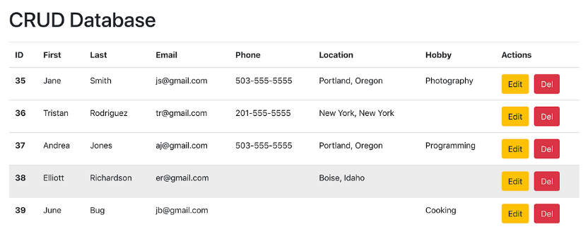

# Simple CRUD

## ⭐ HTTP Request ?

**HTTP Request** (Yêu cầu HTTP) là một thông điệp được gửi từ máy khách (client) đến máy chủ (server) nhằm yêu cầu tài nguyên hoặc thực hiện một hành động cụ thể.

### Phương thức HTTP (HTTP Method)

Xác định loại yêu cầu được thực hiện, ví dụ:

- **GET**: Yêu cầu lấy dữ liệu từ máy chủ.
- **POST**: Gửi dữ liệu đến máy chủ để tạo hoặc cập nhật tài nguyên.
- **PUT**: Cập nhật hoặc thay thế tài nguyên trên máy chủ.
- **DELETE**: Xóa tài nguyên trên máy chủ.

### Dữ liệu của một HTTP request thường bao gồm các thành phần sau

1. **Parameter (Tham số)**: Tham số được gửi qua URL hoặc trong thân của yêu cầu, và nó có thể xuất hiện ở nhiều vị trí khác nhau trong một HTTP request.

   Ví dụ:

   ```
   GET /products/1
   GET /user/nickname
   ```

   Ở đây `1` và `nickname` là các parameters.

2. **QueryString (Chuỗi truy vấn)**: Là tập hợp các cặp key-value nối với nhau bằng dấu `&` và bắt đầu từ dấu `?` trong URL.
   Ví dụ:

   ```
   /search?query=car&page=2
   ```

   `query=car&page=2` chính là chuỗi truy vấn (query string).

3. **Body String (Nội dung)**: Là phần dữ liệu của yêu cầu thường dùng với phương thức POST, PUT, PATCH. Phần này chứa dữ liệu cần gửi lên máy chủ, có thể là JSON, XML, hoặc form data.
   Ví dụ một yêu cầu POST với body JSON:

   ```http
   POST /api/login HTTP/1.1
   Content-Type: application/json

   {
     "username": "user1",
     "password": "password123"
   }
   ```

4. **Header String (Tiêu đề)**: Tiêu đề chứa các thông tin bổ sung về yêu cầu như kiểu dữ liệu, thông tin xác thực, mã hóa... Ví dụ:

   ```
   Content-Type: application/json
   Authorization: Bearer token123
   ```

## ⭐ HTTP Response ?

**HTTP Response** (Phản hồi HTTP) là thông điệp mà máy chủ (server) gửi lại cho máy khách (client) sau khi nhận và xử lý một **HTTP Request**. Nội dung của HTTP Response cung cấp thông tin về kết quả của yêu cầu đó. HTTP Response bao gồm các thành phần chính sau:

1. **Status Line (Dòng trạng thái)**: Dòng đầu tiên của phản hồi chứa:

   - **HTTP Version**: Phiên bản của giao thức HTTP được sử dụng (ví dụ: HTTP/1.1, HTTP/2).
   - **Status Code (Mã trạng thái)**: Mã số xác định kết quả của yêu cầu, gồm 3 chữ số, chia thành 5 nhóm chính:
     - **1xx**: Thông tin (Informational).
     - **2xx**: Thành công (Success), phổ biến nhất là **200 OK**.
     - **3xx**: Chuyển hướng (Redirection).
     - **4xx**: Lỗi từ phía máy khách (Client Error), ví dụ **404 Not Found**.
     - **5xx**: Lỗi từ phía máy chủ (Server Error), ví dụ **500 Internal Server Error**.
   - **Status Message**: Mô tả ngắn gọn mã trạng thái, ví dụ: "OK", "Not Found".

   Ví dụ:

   ```
   HTTP/1.1 200 OK
   ```

2. **Headers (Tiêu đề phản hồi)**: Các thông tin bổ sung về phản hồi, bao gồm:

   - **Content-Type**: Loại dữ liệu của phản hồi (HTML, JSON, XML, v.v.).
   - **Content-Length**: Kích thước của phản hồi (tính bằng byte).
   - **Set-Cookie**: Thông tin cookie mà máy chủ muốn lưu trên máy khách.

   Ví dụ:

   ```
   Content-Type: application/json
   Content-Length: 348
   ```

3. **Body (Nội dung phản hồi)**: Phần này chứa dữ liệu phản hồi từ máy chủ, có thể là HTML, JSON, XML, hoặc các loại dữ liệu khác, tùy thuộc vào yêu cầu ban đầu và cấu hình của máy chủ.
   Ví dụ với dữ liệu dạng JSON:

   ```json
   {
     "message": "Success",
     "data": {
       "id": 123,
       "name": "Product A"
     }
   }
   ```

4. **Cookies (Tùy chọn)**: Cookies cũng có thể được gửi trong phản hồi để lưu thông tin trên máy khách.

Ví dụ về một phản hồi HTTP hoàn chỉnh:

```http
HTTP/1.1 200 OK
Content-Type: application/json
Content-Length: 128

{
  "message": "Data fetched successfully",
  "data": {
    "id": 1,
    "name": "John Doe"
  }
}
```

Trong ví dụ trên, máy chủ phản hồi với mã trạng thái **200 OK**, tiêu đề phản hồi cho biết dữ liệu trả về là JSON, và trong **body** là dữ liệu chi tiết về người dùng.

## ⭐ API là gì ?

**API** (Application Programming Interface) là một tập hợp các quy tắc và giao thức cho phép các ứng dụng phần mềm giao tiếp và tương tác với nhau. API hoạt động như một cầu nối trung gian, cho phép các ứng dụng khác nhau (hoặc các phần của một ứng dụng) trao đổi dữ liệu và chức năng mà không cần hiểu rõ về cấu trúc nội bộ của nhau.

Các thành phần chính của API bao gồm:

1. **Endpoints (Điểm kết nối)**: Các điểm truy cập mà một ứng dụng có thể sử dụng để gửi yêu cầu tới API. Mỗi endpoint thường đại diện cho một tài nguyên hoặc chức năng cụ thể.

2. **Methods (Phương thức)**: Các hành động mà API hỗ trợ, thường liên quan đến HTTP methods như:

   - **GET**: Lấy dữ liệu.
   - **POST**: Gửi hoặc tạo dữ liệu mới.
   - **PUT**: Cập nhật dữ liệu hiện có.
   - **DELETE**: Xóa dữ liệu.

3. **Request (Yêu cầu)**: Gồm thông tin về yêu cầu từ phía client, bao gồm phương thức HTTP, URL endpoint, và dữ liệu (nếu có). Thông thường, yêu cầu chứa các tham số và tiêu đề (headers).

4. **Response (Phản hồi)**: Phản hồi mà API gửi về sau khi xử lý yêu cầu. Phản hồi này thường bao gồm mã trạng thái HTTP, tiêu đề, và nội dung phản hồi (thường là dữ liệu, chẳng hạn như JSON hoặc XML).

5. **Authentication (Xác thực)**: Nhiều API yêu cầu người dùng cung cấp các token hoặc khóa API (API key) để xác thực và đảm bảo bảo mật.

## ⭐ Fake API

Sử dụng công cụ Fake API để luyện tập call API trong React

- <https://jsonplaceholder.typicode.com>

- <https://fakeapi.platzi.com/en/about/introduction/>

- <https://fakestoreapi.com/docs>


## ⭐ Làm quen công cụ TEST API

Sử dụng một số API Public phổ biến để test

- POST MAN
- REST Client

---

## ⭐Cách gọi một API trong React

Sử dụng hàm `fetch` của javascript:

```js
fetch(url, options);
```

- url: là địa chỉ API
- options: là một object tùy chọn, có thể không truyền

Xem chi tiết <https://developer.mozilla.org/en-US/docs/Web/API/Fetch_API/Using_Fetch>

---

Hoặc thư viện `axios`

```bash
npm i axios
yarn add axios
```

Doc: <https://axios-http.com/docs/intro>

Cú pháp của axios gọn gơn fetch một chút

---

> => Học thêm về Promise: [Promise](Promiss.md)

### 💥Phương thức GET

- Thường dùng để lấy danh sách

- Nếu muốn danh sách hiển thị ngay khi component vừa load lên thì ta dùng `useEffect` để fetch data.
- Còn muốn lấy danh sách sau sự kiện gì đó thì không cần `useEffect`

Phương thức GET: Thường dùng để lấy danh sách

```js
import { useState, useEffect } from "react";

interface IUser {
  id: number;
  name: string;
  email: string;
  role: string;
  avatar: string;
}

const UserList = () => {
  const [users, setUsers] = useState<IUser[]>([]);

  useEffect(() => {
    fetch("https://api.escuelajs.co/api/v1/users")
      .then((response) => response.json())
      .then((data) => {
        // handle success
        console.log(data);
        //lấy data gán cho State
        setUsers(data);
      })
      .catch((error) => {
        // handle error
        console.log(error);
      });
  }, []);

  return (
    <div>
      <h1>Users List</h1>
      <table>
        <tr>
          <th>#ID</th>
          <th>Avatar</th>
          <th>Name</th>
          <th>Email</th>
          <th>Role</th>
          <th>Actions</th>
        </tr>
        {users.length > 0 && users.map((user) => {
          return (
          <tr key={user.id}>
            <td>{user.id}</td>
            <td>{user.avatar}</td>
            <td>{user.name}</td>
            <td>{user.email}</td>
            <td>{user.role}</td>
            <td>Edit - Delete</td>
          </tr>
          )
        })}
      </table>
    </div>
  );
};

export default UserList;
```

Còn với `axios`, code gọn hơn một chút.

```js
import { useState, useEffect } from "react";
import axios from "axios";

interface IUser {
  id: number;
  name: string;
  email: string;
  role: string;
  avatar: string;
}

const UserList = () => {
  const [users, setUsers] = useState<IUser[]>([]);

  useEffect(() => {
    axios
      .get("https://api.escuelajs.co/api/v1/users")
      .then((data) => {
        // handle success
        console.log(data);
        //lấy data gán cho State
        setUsers(data);
      })
      .catch((error) => {
        // handle error
        console.log(error);
      });
  }, []); //Mảng rỗng để chỉ thực hiện 1 lần

  return (
    <div>
      <h1>Users List</h1>
      <table>
        <tr>
          <th>#ID</th>
          <th>Avatar</th>
          <th>Name</th>
          <th>Email</th>
          <th>Role</th>
          <th>Actions</th>
        </tr>
        {users.length > 0 &&
          users.map((user) => {
            return (
              <tr key={user.id}>
                <td>{user.id}</td>
                <td>{user.avatar}</td>
                <td>{user.name}</td>
                <td>{user.email}</td>
                <td>{user.role}</td>
                <td>Edit - Delete</td>
              </tr>
            );
          })}
      </table>
    </div>
  );
};
export default UserList;
```

---

### 💥Phương thức POST

Phương thức này thường dùng để tạo mới

Với `Fetch`

```js
const handleSubmit = async () => {
  try {
    let url = "https://jsonplaceholder.typicode.com/posts";

    let payloads = {
      title: "foo",
      body: "bar",
      userId: 1,
    };

    const options = {
      method: "POST",
      headers: {
        "Content-Type": "application/json",
      },
      body: JSON.stringify(payloads),
    };
    //Sử dụng async/await --> không cần then catch
    const response = await fetch(url, options);
    const data = await response.json();

    console.log(data);
    return data;
  } catch (error) {
    console.log(error);
  }
};
```

Còn với `Axios`

```js
    const handleSubmit = async ()=> {
        try {
            let url = 'https://jsonplaceholder.typicode.com/posts';

            let payloads = {
                    title: 'foo',
                    body: 'bar',
                    userId: 1
            };
            const options = {
              headers: {
                'Content-Type': 'application/json'
              }
            };
            await axios
            .post(url, payloads,options)
            .then(function (response) {
                console.log(response);
                return response.data;
            })
        }
        .catch(function (error) {
            console.log(error);
        });
    }

```

Trong ví dụ POST này, thì call API thực hiện khi hành động Submit diễn ra cho nên chúng ta không cần đặt nó trong useEffect

---

### 💥Phương thức PUT

Phương thức này thường dùng để cập nhật thông tin

Với `fetch`:

```js
const handleUpdate = async (data, id) => {
  try {
    const url = `https://api.escuelajs.co/api/v1/users/${id}`;
    const options = {
      method: "PUT",
      headers: {
        "Content-Type": "application/json",
      },
      body: JSON.stringify(data),
    };
    const response = await fetch(url, options);
    const result = await response.json();
    console.log(result);
    reset();
  } catch (error) {
    console.log(error);
  }
};
```

Với `axios`:

```js
const handleUpdate = async (data, id) => {
  try {
    const url = `https://api.escuelajs.co/api/v1/users/${id}`;

    const response = await axios.put(url, data);

    console.log(response);
  } catch (error) {
    console.log(error);
  }
};
```

---

### 💥Phương thức DELETE

Phương thức này thường dùng để XÓA

Với `fetch`:

```js
const handleDelete = async (id: number) => {
  try {
    const url = `https://api.escuelajs.co/api/v1/users/${id}`;
    const options = {
      method: "DELETE",
      headers: {
        "Content-Type": "application/json",
      },
    };
    const response = await fetch(url, options);
    const result = await response.json();
    console.log(result);
  } catch (error) {
    console.log(error);
  }
};
```

Với `axios`:

```js
const handleDelete = async (id: number) => {
  try {
    const url = `https://api.escuelajs.co/api/v1/users/${id}`;

    const response = await axios.delete(url);
    console.log(response);
  } catch (error) {
    console.log(error);
  }
};
```

Ngoài ra còn có thêm một thư viện rất mạnh khác nữa là React Query

## 🔍 So sánh `fetch` vs `axios`

| Tiêu chí                 | `fetch` (native)         | `axios` (thư viện)       |
| ------------------------ | ------------------------ | ------------------------ |
| Có sẵn trong trình duyệt | ✅                        | ❌ Cần cài qua npm        |
| Tự động chuyển JSON      | ❌ `.json()` cần gọi thêm | ✅ Tự động                |
| Xử lý lỗi HTTP           | ❌ Không tự bắt lỗi       | ✅ Có `try/catch` rõ ràng |
| Timeout                  | ❌ Không hỗ trợ           | ✅ Hỗ trợ `timeout`       |
| Tối ưu dev experience    | ⚠️ Viết dài hơn          | ✅ Cú pháp ngắn gọn       |

---

## ⭐ Lưu ý khi gọi API

- Gọi API thường được đặt trong `useEffect`
- Truyền `[]` để gọi một lần khi component mount
- Tránh gọi nhiều lần hoặc vòng lặp vô hạn
- Luôn xử lý `loading`, `error`

## ⭐ Các trạng thái trong Call API

Khi gọi API fetch để tương tác với máy chủ và nhận dữ liệu, có thể xác định các trạng thái khác nhau của quá trình call API. Dưới đây là một số trạng thái phổ biến khi sử dụng API fetch trong React:

1. Chưa gửi yêu cầu (Pending):

Quá trình gửi yêu cầu API fetch chưa được bắt đầu hoặc đang chờ.
Trạng thái ban đầu trước khi gửi yêu cầu.

2. Đang gửi yêu cầu (Loading):

Yêu cầu API fetch đang được gửi đi và đang chờ phản hồi từ máy chủ.
Thường sử dụng để hiển thị một biểu tượng tải trong quá trình gửi yêu cầu.

3. Thành công (Success):

Yêu cầu API fetch đã được xử lý thành công và trả về kết quả dữ liệu.
Dữ liệu từ phản hồi API có sẵn và có thể được sử dụng để cập nhật giao diện người dùng.

4. Lỗi (Error):

Xảy ra lỗi trong quá trình gửi yêu cầu hoặc xử lý yêu cầu API fetch.
Thông báo lỗi có thể hiển thị hoặc xử lý lỗi để đưa ra các biện pháp khắc phục.

==> Để tăng trải nghiệm người dùng UX, bạn phải làm cho UI thể hiện các trạng thái đó trong 1 chu kỳ call API

## ⭐ API with Authentication

Call API có sử dụng phương thức xác thực `Authorization`: `basic token`, `Bearer token`

Thực hành với: <https://fakeapi.platzi.com/en/rest/auth-jwt>

### Authentication Với Fetch

```js
const url = `https://api.escuelajs.co/api/v1/auth/profile`;
const options = {
  method: "GET",
  headers: {
    "Content-Type": "application/json",
    // 'Content-Type': 'application/x-www-form-urlencoded',
    Authorization: "Bearer {your access token}", //Thay Thế Token vào
  },
};
fetch(url, options)
  .then((response) => response.json())
  .then((data) => {
    // handle success
    console.log(data);
  })
  .catch((error) => {
    // handle error
    console.log(error);
  });
```

### Authentication Với Axios

```js
const url = `https://api.escuelajs.co/api/v1/auth/profile`;
const options = {
  headers: {
    Authorization: "Bearer {your access token}", //Thay Thế Token vào
    //Authorization: "Basic {your access token}", //Thay Thế Token vào
  },
};
axios
  .get(url, options)
  .then((data) => {
    // handle success
    console.log(data);
    //lấy data gán cho State
    setUsers(data);
  })
  .catch((error) => {
    // handle error
    console.log(error);
  });
```

## ⭐ Tạo ứng dụng CURD đơn giản



Sử dụng Fake API: <https://fakeapi.platzi.com/en/rest/users/#get-all-users>

Tech Tips:

- fetch, axios, ReactQuery
- AntDesign

## ⭐ Tự tạo Fake API

Sử dụng [MockAPI](https://mockapi.io) để tạo REST API fake
