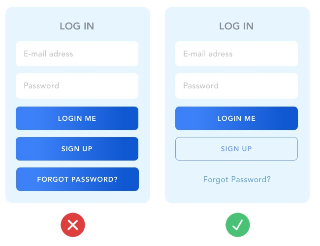
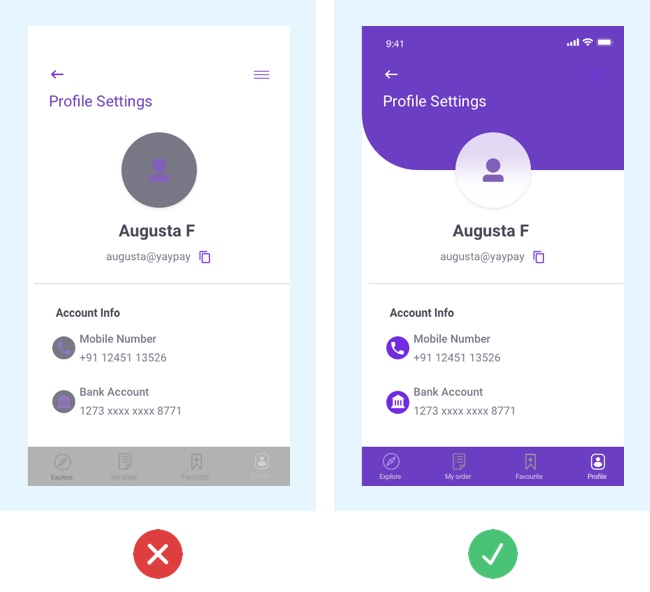

# Session 12 - UI / UX

Nếu bạn muốn trở thành một frontEnd Dev giỏi bạn nhất định bạn cần phải biết đến khái niệm UI - UX

## UI là gì: Định nghĩa

**UI** là viết tắt của từ **User Interface** có nghĩa là giao diện người dùng. Hiểu một cách đơn giản nhất thì UI bao gồm tất cả những gì người dùng có thể nhìn thấy như: màu sắc web, bố cục sắp xếp như thế nào, web/app sử dụng fonts chữ gì, hình ảnh trên web có hấp dẫn hay không,...

Trong thiết kế thì UI đóng vai trò là yếu tố truyền tải thông điệp từ người thiết kế, nhà cung cấp dịch vụ, sản phẩm tới người dùng. Đơn giản hơn thì nhà thiết kế đóng vai trò như 1 lập trình viên hoặc nhà xây dựng để bất cứ ai cũng có thể hiểu và sử dụng được sản phẩm của họ .

**Ví dụ:** Trên cương vị là một người thợ mộc khi bạn đóng một cái giường thì trước tiên sản phẩm bạn làm ra phải giống một cái giường đã, không thể cái giường lại giống 1 cái bàn được đúng không nào? Thì ở đây UI cũng được hiểu tương tự như vậy.

**Các bài viết tham khảo**

- https://viblo.asia/p/ui-ux-la-gi-ui-ux-design-la-gi-m68Z0MJ6lkG

- https://www.brandsvietnam.com/congdong/topic/325840-UI-la-gi-10-nguyen-tac-cua-mot-giao-dien-hieu-qua


**UI bao gồm 2 yêu tố:**

- Thiết kế trực quan (Visual Design)
- Thiết kế tương tác (Interaction Design)

### Thiết kế trực quan (Visual Design)

Visual Design hay còn được gọi là thiết kế trực quan là việc tập trung thiết kế vào các trải nghiệm của người dùng, khả năng tương tác của khách hàng đó đối với sản phẩm. Thuật ngữ Visual Design không thường xuất hiện trong các cuộc đối ngoại hay cuộc sống sinh hoạt hàng ngày. Nó được sử dụng nhiều hơn trên các trang web, các thiết kế website, thiết kế ứng dụng, thiết kế giao diện,…sao cho phần bề ngoài thu hút được nhiều người xem và quan tâm nhất.


Nhìn chung, những tính năng của Visual Design xoay quanh việc mang lại tính thẩm mỹ cho người xem. Từ đó giúp họ có những trải nghiệm mới lạ, độc đáo thông qua việc xem xét, đánh giá các hiệu ứng minh họa, nhiếp ảnh, bố cục, không gian, màu sắc,…

Nhiệm vụ chính của Visual Design khi xuất hiện trước công chúng đó chính là đem lại sự thú vị, kích thích sự tò mò và hứng thú cho người xem nhất có thể. Vậy để thu hút được một lượng lớn người quan tâm và có những trải nghiệm đáng nhớ hơn, Visual Design phải có những “tố chất” đặc biệt như sau:

- Tính thống nhất, đồng bộ
- Nguyên tắc Gestalt
- Không gian
- Màu sắc
- Sự phân cấp bậc
- Tương phản
- Tỉ lệ
- …

Xem bài viết: https://arena.fpt.edu.vn/visual-design-la-gi/

### Thiết kế tương tác (Interaction Design)

Interaction design là giai đoạn các app developer phân chia tương tác và sử dụng các nhân tố hữu hình như animation. Từ đó công cụ sẽ nâng cao việc trải nghiệm web – app lên một tầm cao mới bằng việc quan sát cách giao tiếp và dẫn lối phản xạ, hành vi của người dùng.

Khi khám phá về người sử dụng web – app, interaction design sẽ tập trung khai phá những ý kiến phản hồi của khách hàng, ví dụ như “Tôi chưa rõ cách đăng kí như thế nào”, “Tôi phải làm những gì tiếp theo”.. Những điều này tiết lộ cho các nhà thiết kế website biết những vấn đề mà người dùng đang gặp phải để tính toán giải pháp giúp giải quyết mọi khó khăn của khách hàng.


**Interaction design dự trên một số nguyên tắc cốt lõi bao gồm:**

- Thiết kế hướng tới mục tiêu: Ưu tiên hàng đầu của thiết kế tương tác là thỏa mãn các nhu cầu và mong muốn cụ thể của người dùng.

- Khả năng sử dụng: Người dùng có thể nắm bắt các cơ chế của interaction design gần như là ngay lập tức do vậy nó cần nên dễ sử dụng.

- Khả năng tìm hiểu: Các nguyên tắc thiết kế tương tác thông thường áp dụng cho các trang web, web, máy tính bảng và các ứng dụng điện thoại thông minh. Do vậy mà các nhà thiết kế nên sử dụng các mẫu, hình dạng và màu sắc mà người dùng đã quen thuộc. Và các nguyên tắc và quy tắc thiết kế này hiện đang được áp dụng cho nhiều ứng dụng và phần mềm đa dạng.

Xem bài viết: <https://arena.fpt.edu.vn/interaction-design-la-gi>

### Vì sao UI quan trọng?

Theo cuộc khảo sát từ Finances Online, 90% người tham gia phỏng vấn cho biết họ sẽ thoát khỏi một trang web nếu giao diện web có thiết kế xấu, nghĩa là tỷ lệ này còn chưa tính đến những yếu tố như tốc độ tải trang, luồng điều hướng người dùng,..

90% là một con số rất cao, nhưng lại hợp lý nếu chúng ta xét trong bối cảnh hiện tại. Người dùng hiện nay đang có quá nhiều lựa chọn và do đó, quyền sử dụng hoặc không sử dụng một trang web, ứng dụng là của họ. Chưa bàn đến những điều sâu xa, nguyên nhân đầu tiên khiến UI quan trọng là vì nó ảnh hưởng đến trải nghiệm của người dùng, tức UX.

Những yếu tố như bố cục, màu sắc, typography, luồng điều hướng đều ảnh hưởng đến một người sử dụng theo nhiều cách khác nhau. Nếu chúng khó hiểu và kém hiệu quả, người dùng sẽ gặp khó khăn trong việc thực hiện tác vụ của mình, họ sẽ mắc nhiều lỗi hơn và tất cả dẫn đến một trải nghiệm tiêu cực.

Ví dụ một số sai lầm UI






Xem bài viết: https://careerfoundry.com/en/blog/ui-design/common-ui-design-mistakes/

## UX là gì ?

Viết tắt từ User Experience – trải nghiệm người dùng, UX là quá trình tạo ra sản phẩm cung cấp trải nghiệm có ý nghĩa liên quan tới người dùng (hay khách hàng), bao gồm toàn bộ quá trình ứng dụng và tích hợp sản phẩm kết hợp nhiều khía cạnh như: branding (thương hiệu), design (thiết kế), usability (khả năng sử dụng) và function (chức năng).

UX tập trung vào đánh giá của người dùng khi sử dụng sản phẩm. Liệu Web/ Mobile App của bạn có thân thiện với người dùng không? Họ có gặp khó khăn khi sử dụng không? Người dùng có dễ dàng tìm thấy thứ họ muốn trên website của bạn không?....989

Xem bài viết:

- https://topdev.vn/blog/ux-la-gi-ux-designer-thi-lam-nhung-gi/
- https://adcvietnam.net/khai-niem-co-ban-ve-thiet-ke-ux--trai-nghiem-nguoi-dung

## Nguồn ý tưởng UI,UX

- https://inspirationmobile.tumblr.com
- https://www.pttrns.com/
- https://dribbble.com/tags/food_app#
- https://www.pinterest.com/efreedman/ux-mobile-design-inspiration/
- Kiến thức UX căn bản: https://balsamiq.com/learn/courses/intro-to-ux-design/
- Kiến thức UX nâng cao: https://uxmastery.com/

## Các thư viện UI Components

### AntDesign

Ant Design là một thư viện giao diện người dùng (UI) được tạo ra bởi Ant Design Corporation, một công ty của Trung Quốc. Thư viện này cung cấp một bộ sưu tập các thành phần giao diện đẹp, hiện đại và chuyên nghiệp, hỗ trợ xây dựng các ứng dụng web và mobile với giao diện người dùng tốt và dễ sử dụng.

Ant Design hỗ trợ nhiều ngôn ngữ lập trình như React, Angular, Vue và TypeScript, giúp bạn sử dụng thư viện dễ dàng trong các dự án phát triển ứng dụng. Điều này giúp bạn tập trung vào logic kinh doanh và xây dựng giao diện đẹp và mạnh mẽ một cách dễ dàng.

Cài đặt: https://ant.design/docs/react/introduce

```bash
npm install antd
yarn add antd
```

Cách dùng:

```js
/*
Dùng Component nào thì destructuring ra
*/
import { Button, Space } from "antd";
const App = () => (
  <Space wrap>
    <Button type="primary">Primary Button</Button>
    <Button>Default Button</Button>
    <Button type="dashed">Dashed Button</Button>
    <Button type="text">Text Button</Button>
    <Button type="link">Link Button</Button>
  </Space>
);
export default App;
```

Ant Design thường dùng cho các ứng dụng thiên về quản lý: Dashboard, nhập liệu nhiều

### Chakra UI

https://chakra-ui.com/

Chakra UI là một thư viện giao diện người dùng (UI) mã nguồn mở dựa trên React, được thiết kế để giúp bạn xây dựng các ứng dụng web với giao diện đẹp, tùy chỉnh và dễ sử dụng. Chakra UI tập trung vào việc cung cấp các thành phần giao diện tái sử dụng và tiết kiệm thời gian, giúp bạn tập trung vào việc xây dựng ứng dụng thay vì tạo lại các thành phần giao diện cơ bản.

Cài đặt với React Vite: https://chakra-ui.com/getting-started/vite-guide

### Semantic UI React

Semantic UI React là một thư viện giao diện người dùng mã nguồn mở dựa trên React, cung cấp các thành phần giao diện đẹp và tương tác. Nó sử dụng cú pháp đơn giản và rõ ràng, giúp bạn xây dựng giao diện dễ dàng và nhanh chóng.

https://react.semantic-ui.com/

### Material-UI

Material-UI là một thư viện giao diện người dùng (UI) mã nguồn mở dựa trên nguyên lý thiết kế Material Design của Google. Nó được xây dựng cho React và cung cấp một bộ sưu tập các thành phần giao diện đẹp, hiện đại và tương tác, giúp bạn xây dựng các ứng dụng web với giao diện người dùng chất lượng cao.

Material-UI được sử dụng rộng rãi trong cộng đồng React và đã trở thành một trong những lựa chọn hàng đầu cho việc xây dựng giao diện người dùng đẹp và mạnh mẽ. Nếu bạn đang tìm kiếm một thư viện giao diện React dựa trên Material Design, Material-UI là một sự lựa chọn tuyệt vời để thử nghiệm và triển khai.

Cài đặt: https://mui.com/material-ui/getting-started/installation/

```bash
npm install @mui/material @emotion/react @emotion/styled

yarn add @mui/material @emotion/react @emotion/styled
```

Xem chi tiết thêm ở link trên

Cách dùng:

```js
import * as React from "react";
import Stack from "@mui/material/Stack";
import Button from "@mui/material/Button";

export default function BasicButtons() {
  return (
    <Stack spacing={2} direction="row">
      <Button variant="text">Text</Button>
      <Button variant="contained">Contained</Button>
      <Button variant="outlined">Outlined</Button>
    </Stack>
  );
}
```

### React Bootstrap

Cách cài đặt: https://react-bootstrap.netlify.app/docs/getting-started/introduction

```bash
npm install react-bootstrap bootstrap
#hoặc
yarn add react-bootstrap bootstrap
```

Tiếp theo: Cấu hình Css global

```jsx
{
  /* The following line can be included in your src/index.js or App.js file */
  /* Thêm vào file src/App.tsx (React Vite) */
}
import "bootstrap/dist/css/bootstrap.min.css";
```

Cách dùng:

```jsx

import {Button, Stack} from 'react-bootstrap';
//Hoặc
//import Button from 'react-bootstrap/Button';
//import Stack from 'react-bootstrap/Stack';

const Myconponent = ()=>{
  return (
    <Stack direction="horizontal" gap={2}>
    <Button as="a" variant="primary">
      Button as link
    </Button>
    <Button as="a" variant="success">
      Button as link
    </Button>
  </Stack>;
  )
}
```

## UI HoT Trend Khác

- https://ui.shadcn.com
- https://www.radix-ui.com
- https://daisyui.com
- https://flowbite.com/docs/getting-started/introduction/

## Bài tập

Làm lại: https://github.com/nhannn87dn/Learn-ReactJs-Basic/tree/main/3.Homeworks/Session-06-Form/Exercise-2

Sử dụng Ant Design
