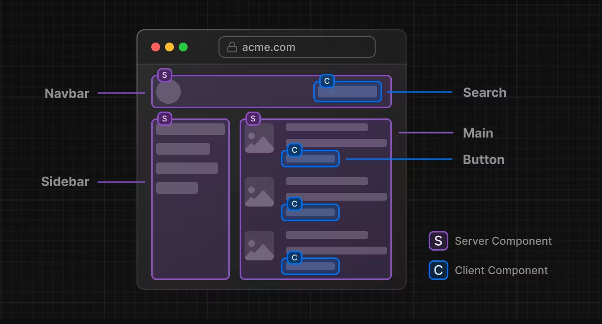

# ⭐ Components and Props

## 🔥 Component trong React là gì ? 

- Trong React, "component" (thành phần) là một phần của giao diện người dùng được chia thành các phần nhỏ, có thể tái sử dụng và độc lập. Chúng giúp bạn chia nhỏ các phần phức tạp của ứng dụng thành các phần nhỏ hơn, dễ quản lý và tái sử dụng.

-React được xây dựng trên cơ sở của các thành phần. Mỗi thành phần là một đoạn mã JavaScript độc lập có thể nhận dữ liệu đầu vào và trả về một phần giao diện người dùng (UI) cụ thể. Khi dữ liệu đầu vào thay đổi, giao diện người dùng sẽ được cập nhật một cách tự động mà không cần phải thực hiện lại trang web.

- Chúng ta có thể xây dựng giao diện người dùng bằng cách kết hợp các Component lại với nhau
- Có 2 loại component là Function Component và Class Component.

Doc:  

- <https://react.dev/learn/your-first-component>
- <https://www.w3schools.com/REACT/react_components.asp>


**Thinking in React:** <https://react.dev/learn/thinking-in-react>

> Component trong React  chúng ta hướng tới đó là một thành phẩn nhỏ, một block UI

>Bất kỳ một thành phẩn UI nào hiển thị ra màn hình đều có thể là một Component




Ví dụ thực tế Components: 5.Demo-Projects\product.html

***

### 🔷 Cách định nghĩa 1 component

Trong Demo trên chúng ta có các button Thêm giỏ hàng, Gọi tư vấn

Thử tạo 2 button đó trong React

Trong file App.js bạn thêm đoạn code sau


```js
//Định nghĩa một component
function ButtonAddToCart() {
  return (
      <button type='button'>Thêm giỏ hàng</button>
  )
}
```

Hoặc các bạn thấy trên thanh Navigations có các liên kết bằng thẻ `a`

Thì trong React nó có thể được viết thành một Component

```js
function LinkHome(){
  return (
    <a href="home">Home</a>
  )
}
```

Hoặc một ví dụ khác: Hình đại diện bài viết có thể được viết thành một component

```js
function ArticleThumbnail(){
  return (
    <div>
      
    </div>
  )
  
}
```

Kết luận: Với cách định nghĩa trên thì các bạn đã tạo ra được một function component trong React

***

### 🔷 Cách đặt tên một Component

Bắt buộc ký tự đầu tiên phải viết HOA theo kiểu Pascal Case (còn được gọi là Upper Camel Case)

Ví dụ: Profile, BlogDetails

***

### 🔷 Sử dụng một Component

```js
//App.js

// Sử dụng component Button
function App() {
  return (
    <section>
      <h1>Hello Components</h1>
      <Button />
    </section>
  );
}
export default  App;
```

***

### 🔷 Các Components lồng vào nhau

Tạo thêm một Component ActionsButton

```js
function ActionsButton(){
  return (
    <div>
      <Button />
      <Button />
    </div>
  )
}
```

App.js sửa lại như sau:

```js

function App() {
  return (
    <section>
      <h1>Hello Components</h1>
      <ActionsButton />
    </section>
  );
}
export default  App;
```


### 🔷 Import và Export Components

React nổi bật với việc tái sử dụng, do vậy bạn nên chia nhỏ thành nhiều các component.

Để làm được vậy bạn cần tạo ra một file .js hoặc .jsx, .ts và đặt code của component vào trong đó.

Theo convension bạn nên tạo ra một folder tên là components bên trong src.

Ví dụ: Tạo một một file src/components/ButtonAddToCart.js (tên file bằng tên Component)

```js
function ButtonAddToCart() {
  return (
      <button type='button'>Thêm giỏ hàng</button>
  )
}
//ES6 syntax 
export default ButtonAddToCart;
```

Bây giờ tại component muốn sử dụng lại Car.js thì import vào

```js
import React from 'react';
//ES6 import
import ButtonAddToCart from './ButtonAddToCart.js';


function App() {
  return (
    <>
      <h1>Hello React Components</h1>
      <ButtonAddToCart />
    </>
  );
}

```

***

## 🔥 Khi nào thì cần tạo một Component ?

- Một tính năng, thành phần lặp đi lặp lại và nhận thấy có thể tái sử dụng

Ví dụ:

>Cùng kiểu dáng Chỉ khác nhau màu nền, màu chữ, icon


=> Ta chỉ cần tạo ra 1 component và tái sử dụng cho all các trường hợp


- Một thành phần có thể chạy độc lập, mà bạn chỉ muốn nó re-Render lại khi cần thiết.

- Một thành phần thường xuyên thay đổi nội dung.


## 🔥 Props là gì ? 

- Props là các tham số được truyền vào một React components.
- Props có thể sử dụng như là một HTML attribute

### 🌻 Tại sao lại cần đến Props?

Để trả lời câu hỏi này chúng ta cùng tạo ra 2 button trên như sau:

```js
function ButtonAddToCart() {
  return (
      <button type='button'>Thêm giỏ hàng</button>
  )
}
function ButtonCall() {
  return (
      <button type='button'>Gọi tư vấn</button>
  )
}
```

Với kiến thức đã học trên thì bạn tạo ra 2 button trên với cách code như vậy.

Tuy nhiên nó mất đi cái đặt tính nổi bật của component là TÁI SỬ DỤNG.

Bạn nhận thấy rằng 2 button trên hoàn toàn giống nhau, nó chỉ khác phần `label` tên hiển thị.

Thì chính lúc này ta cần đến một biến mà trong React gọi là `props`

Chúng ta chỉ cần tạo ra 1 component

```js
//Button nhận vào một tham số có tên mặc định trong React là props ==> nó là một object
function Button(props) {
  return (
    <button type='button'>{props.label}</button>
  )
}
```

Khi đó để tạo ra 2 button như demo thì trong App.js

```js
function App() {
  return (
    <>
      <h1>Hello React Components</h1>
      <Button label='Thêm giỏ hàng' />
      <Button label='Gọi Tư Vấn' />
    </>
  )
}
```

Trên đây ta sử dụng thuộc tính label='' thì React nó tự động thêm vào `props` một phần tử có key là `label` và value là giá trị trong dấu `=`

Khi đó trong component Button chúng ta truy cập tới giá phần từ `label` để lấy giá trị của nó `props.label` như object bình thường.

***

### 🌻 Truyền Props cho một Component

React components sử dụng các props để giao tiếp với nhau. Component CHA cần truyền thông tin đến component CON bằng cách sử dụng props. 

Props sử dụng như HTML attributes, nhưng bạn có thể truyền bất kỳ giá trị JavaScript thông qua chúng, bao gồm cả objects, arrays, và functions


Lấy lại ví dụ trên các bạn có thể thêm cho nó nhiều thuộc tính khác:

```js

function Button(props) {
  return (
    <button type='button'>{props.label}</button>
  )
}

function App() {
  
  function handeClick(){
    console.log('you clicked');
  }

  return (
    <>
      <h1>Hello React Components</h1>
      
      <Button onClick={handeClick} fontSize={18} bgColor='#ff6700' label='Thêm giỏ hàng' customStyle={{fontWeight: 'bold', textTransform: 'uppercase'}} />

      <Button label='Gọi Tư Vấn' />
    </>
  )
}

```
Chúng ta nhận thấy Component Button nhận vào tham số `props`.

Bên trong thân nó chúng ta không hình dung được là nó đang có những thuộc tính nào để mà sử dụng.

Làm sao biết có label để `props.label` ?

Khi đó chúng ta có một cách biết khác TƯỜNG MINH hơn như sau

```js
//Cú pháp Destructuring một Object
//props = {label, fontSize, bgColor, customStyle}
//{label, fontSize, bgColor, customStyle} = props
function Button({label, fontSize, bgColor, customStyle}) {
  return (
    <button type='button'>{props.label}</button>
  )
}
```
***

### 🌻 Default Props

Trong React, chúng ta cũng có thể sử dụng function để tạo component. Cũng như ES6 React Component, chúng ta cũng có thể định nghĩa thuộc tính defaultProps

```js
function Button(props) {
  return (
    <button type='button'>{props.label}</button>
  )
}
// Kiểu như là đặt giá trị dự phòng, nếu ko truyền thì nó lấy giá trị mặc định hiển thị.
Button.defaultProps = {
    label: "Button Label",
    color: "#fff",
    bgColor: "#ff6700" 
}

```

***

### 🌻 Props Children

Bạn có thể lồng các component vào với nhau giống như các thẻ HTML vậy, điều đó làm cho JSX trông giống với HTML. Và các component hay nội dung được lồng ở trong các component được gọi là children

**Child component**

```js
<Dad>
    <Son />
    <Son />
    <Son />
</Dad>
```

Ở đây ta có 3 component `<Son />`, chúng sẽ là props.children của component `<Dad />`

Khi đó `<Dad />` sẽ trong như thế này

```js
function Dad(props){
  return (
    <div>
      {props.children}
    <div>
  )
}
//hoặc
function Dad({children}){
  return (
    <div>
      {children}
    <div>
  )
}
```

**Everything can be a child**

Children trong React thì không nhất thiết phải là cái gì, nó có thể là 1 component hay nhiều component, 1 thẻ h1 hoặc nhiều thẻ h1, 1 chữ hoặc nhiều chữ...

```js
<Dad>
    <h1>Hello Children</h1>
</Dad>
```

Bạn chỉ cần nhớ một điều:

Children là phần nội dung lòng vào giữa một component.


***

### 🌻 Truyền một prop từ App xuống component CON lồng vào nhau rất SÂU

Bải giảng: [Ở đây](1.RoadMap-40h\Session-07-Hooks\useContext.md)

Ví dụ có một object

```js
const userInfo = {
  id: 1, 
  name: 'John',
  avatarUrl: 'http://'
}
```

Và có một component lồng vào nhau rất SÂU

```js
function UserInfo() {
  return (
    <>
      <span>
      Username: ???
    </span>
    </>
  )
}

function HeaderPage() {
  return (
    <>
    <UserInfo />
    </>
  )
}

function HomePage() {
  return (
    <>
    <HeaderPage />
    </>
  )
}

function App() {
  return (
    <>
    <HomePage />
    </>
  )
}

```

Làm sao để truyền userInfo từ App xuống component UserInfo để hiển thị name ra chỗ ???

- Cách bình thường: truyền props lần lượt vào các component từ APP xuống UserInfo
- Cách khác: dùng useContext

Cách thực hiện với useContext:

* **Bước 1**: Tạo folder src/context
* **Bước 2**: Trong thư mục src/context tạo file `userContext.tsx`

```js
import React from "react";

interface UserType {
  id: number;
  name:string;
  avatarUrl:string;
}
//Bước 1: Tạo context
//createContext nhận vào giá trị khởi tạo, mặc đinh là null
export const userContext = React.createContext<UserType | null>(null);

// Bước 2: Tạo Provider context
//userContext.Provider sử dụng props value mặc định: chứa thông tin cần truyền xuống children
export const UserProvider = ({user, children}: {user: UserType, children?: React.ReactNode}) => {
  return <userContext.Provider value={user}>
      {children}
    </userContext.Provider>;
};


```

* **Bước 3**: Sửa code App lại như sau

```js
//Import Provider vào App
import { UserProvider } from "./context/userContex";

function App() {
  console.log("App rendered");
  return (
    <div>
      <UserProvider user={userInfo}>
        <HomePage />
       </UserProvider>
    </div>
  );
}

export default App;
```


* **Bước 4**: Để component UserInfo lấy được thông tin user

```js
import React from 'react';
import {userContext} from '../../../../context/userContext';

function UserInfo() {
  const userInfo = React.useContext(userContext);
  return (
    <>
      <span>
      Username: {userInfo.name}
    </span>
    </>
  )
}
```


### 🌻 Props với TypeScript

Chuyển các ví dụ trên thành TypeScript


Tham khảo sử dụng Prop với TypeScript

- <https://github.com/typescript-cheatsheets/react#basic-prop-types-examples>

- <https://cinthialandia.com/blog/props/>


## 🔥 Từ HTML đến React Component

Cách nhìn nhận từ một HTML UI làm sao chuyển nó thành React UI hợp lý.

Xem ví dụ: <https://widget-components.vercel.app>
