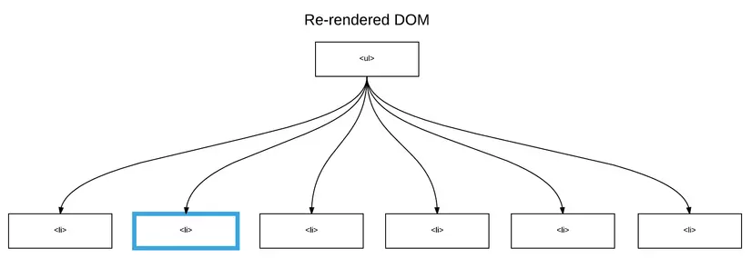

# Rendering Elements ?

## ⭐  1. Render một Element đến DOM

Quá trình Render diễn ra như thế nào trong React ?
- Khi bạn khởi chạy một App React thì React sẽ tiến hành Render các Component.

> Xem file index.js trong project

- React Gọi hàm root.render() để thực hiện render và trả lại kết quả vào ReactDOM

- ReactDOM có nhiệm vụ thực hiện nạp kết quả vào thẻ `

` có id là root ở file public\index.html

- Và cuối cùng Là kết quả được hiển thị ra màn hình.
Bạn view code lên thì thấy `

` trống rỗng không chứa gì cả nhưng lại thấy kết quả hiển thị ra màn hình trình duyệt.

- root.render() chỉ chạy 1 lần, chính vì lí do này mà  khi có nhiều Elements thì cần đặt chúng trong một thẻ CHA.

## ⭐ React Update một Element đã Render (Rerender) như thế nào ?

- React Element là bất biến không thay đổi, bạn không thể thay đổi các element con, các thuộc tính của nó. Bạn có thể hiểu đơn giản nó như một **snapshot** của Virtual DOM (có thể hiểu là bản ghi trạng thái ngay lúc đó) 
- Cách duy nhất React cập nhật giao diện người dùng (IU) là tạo ra một **snapshot**  mới và đẩy chúng tới `root.render()` để render hiển thị ra màn hình.

Ví dụ minh họa: <https://codepen.io/gaearon/pen/gwoJeZ?editors=1010>

## ⭐ React chỉ update những gì cần thiết

- Trong React: React chỉ cập nhật thay đổi cần thiết hay là thay đổi ở đâu thì chỉ cập nhật chổ đó rồi Render lại IU

React lấy một snapshot của Virtual DOM (có thể hiểu là bản ghi trạng thái ngay lúc đó) ngay trước khi áp dụng bất kỳ bản cập nhật nào. Sau đó, nó sử dụng snapshot này để so sánh với một Virtual DOM được cập nhật trước khi thực hiện các thay đổi.

Khi cập nhật được cấp cho Virtual DOM, quá trình tiếp theo React sử dụng thuật toán Diffing để so sánh và đối chiếu để biết được sự cập nhật được diễn ra ở đâu sau đó cập nhật nó mà bỏ qua những elements không liên quan.

Chỉ những đối tượng này được cập nhật trên DOM và các thay đổi trên DOM vừa rồi sẽ làm cho màn hình thay đổi.

Ví dụ minh họa thực tế.

Chúng ta sẽ đi tìm hiểu sâu hơn về cách mà một Component Render trong phần sau.

## 🔶 DOM ảo (Virtual DOM) là gì?

- DOM là viết tắt của Document Object Model. DOM đại diện cho một tài liệu HTML có cấu trúc cây logic. Mỗi nhánh của cây kết thúc bằng một nút và mỗi nút chứa các đối tượng.

- React giữ một bản “đại diện” nhưng nhẹ hơn của DOM “thực” trong bộ nhớ, gọi là DOM ảo (Virtual DOM). Khi trạng thái của một đối tượng (object) thay đổi, DOM ảo chỉ thay đổi đối tượng đó trong DOM thực, thay vì cập nhật tất cả các đối tượng.

Bạn có thể tưởng tượng, ở DOM có thẻ div và các thẻ p ở trong, React sử dụng Virtual DOM bằng cách tạo ra các object React.div và React.p và khi tương tác, ta sẽ tương tác qua các object đó một cách nhanh chóng mà không phải đụng tới DOM hay DOM API của nó.

Virtual DOM được tạo mới sau mỗi lần render lại.

## ⭐  Client Side Rendering ?

Client Side Rendering (CSR) là một phương pháp render trang web mới hơn, đối với phương pháp này JS được thực thi ở phía trình duyệt thông qua các Javascript framework

## ⭐  Server Side Rendering ?

Server Side Rendering (SSR) là phương pháp render (kết xuất) truyền thống.

Về cơ bản, tất cả các tài nguyên trên trang của bạn đều được lưu trữ trên máy chủ (server). Khi trang được yêu cầu truy cập, máy chủ sẽ trả về trang HTML để hiển thị trên trình duyệt, JS và CSS cũng được tải xuống và nội dung trang cuối cùng sẽ hiển thị tới người dùng
