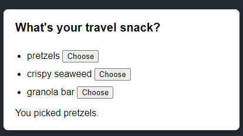

# 🔥 6.5 Managing State (Advanced)

Các cách nâng cao để bạn tối ưu và quản lý State đúng và hiệu suất.

View details: <https://react.dev/learn/managing-state>


## 6.5.1 Reacting to Input with State

>Đưa ra các phản ứng khi thao tác form input với State


Khi làm việc với React liên quan đến vấn đề tương tác người dùng. Bạn phải nắm được các hành vi, các vấn đề có thể xay ra xung quang một sự kiện tương tác từ người dùng.


Như ví dụ trên:

- Lúc đầu input là empty
- Khi chưa điền số điện thoại vào chúng ta muốn là nút Đăng ký không thể click được (disable)
- Khi chúng ta điền số điện thoại vào thì button Đăng ký mới cho phép click
- Rồi khi chúng ta click một cái thì phải disable ngay, để tránh người dùng click nhiều lần. 
- Sau sau khi click thì lại có thêm 2 trạng thái có thể xảy ra
  - Thành công
  - Thất bại, có lỗi

Thì chúng ta các trạng thái State tương ứng với từng vấn đề trên như sau:

```js
const [isEmpty, setIsEmpty] = useState(true);
const [isTyping, setIsTyping] = useState(false);
const [isSubmitting, setIsSubmitting] = useState(false);
const [isSuccess, setIsSuccess] = useState(false);
const [isError, setIsError] = useState(false);
```

Áp dụng vào ví dụ trên.

```js
import { useState } from 'react';

export default function CallForm() {
  const [mobile, setMobile] = useState('');
  const [error, setError] = useState(null);
  const [status, setStatus] = useState('typing');

  if (status === 'success') {
    return <h1>That's right!</h1>
  }

  async function handleSubmit(e) {
    e.preventDefault();
    setStatus('submitting');
    try {
      await submitForm(mobile);
      setStatus('success');
    } catch (err) {
      setStatus('typing');
      setError(err);
    }
  }

  function handleInputChange(e) {
    setMobile(e.target.value);
  }

  return (
    <>
      <h2>City quiz</h2>
      <p>
        In which city is there a billboard that turns air into drinkable water?
      </p>
      <form onSubmit={handleSubmit}>
        <input
          value={mobile}
          onChange={handleInputChange}
          disabled={status === 'submitting'}
        />
        <br />
        <button disabled={
          mobile.length === 0 ||
          status === 'submitting'
        }>
          Đăng ký
        </button>
        {error !== null &&
          <p className="Error">
            {error.message}
          </p>
        }
      </form>
    </>
  );
}

function submitForm(mobile) {
  // Pretend it's hitting the network.
  return new Promise((resolve, reject) => {
    setTimeout(() => {
      let shouldError = mobile.length > 0 && mobile.length !== 10;
      if (shouldError) {
        reject(new Error('Số điện thoại không hợp lệ'));
      } else {
        resolve();
      }
    }, 1500);
  });
}


```


## 6.5.2 Choosing the State Structure

>Lựa chọn cấu trúc hợp lý cho State

**Các nguyên tắc để tạo ra một cấu trúc State CHUẨN**

1. [Group related state](https://react.dev/learn/choosing-the-state-structure#group-related-state) (Nhóm các State liên quan).

 Nếu bạn luôn update hai hoặc nhiều State cùng một lúc thì nên gộp chúng lại thành một State duy nhất bằng cách dùng Object

Ví dụ:

```js
const [x, setX] = useState(0);
const [y, setY] = useState(0);
```

Thay thế bằng

```js
const [position, setPosition] = useState({ x: 0, y: 0 });
```


2. [Avoid contradictions in state](https://react.dev/learn/choosing-the-state-structure#avoid-contradictions-in-state). (Tránh tạo ra sự hiểu nhầm giữa các State)

Ví dụ bạn có một khung chát


```js
const [text, setText] = useState('');
  const [isSending, setIsSending] = useState(false);
  const [isSent, setIsSent] = useState(false);

  async function handleSubmit(e) {
    e.preventDefault();
    setIsSending(true);
    await sendMessage(text);
    setIsSending(false);
    setIsSent(true);
  }
```

Gây ra sự nhập nhằng không biết lúc nào thì Đang gửi, lúc nào thì đã gửi.

Giải pháp là hãy tạo ra một State status trạng thái duy nhất

```js
const [text, setText] = useState('');
const [status, setStatus] = useState('typing');

  async function handleSubmit(e) {
    e.preventDefault();
    setStatus('sending');
    await sendMessage(text);
    setStatus('sent');
  }
```

3. [Avoid redundant state](https://react.dev/learn/choosing-the-state-structure#avoid-redundant-state) (Tránh tình trạng dư thừa)

Ví dụ có một form cần điền vào 2 trường


Sau đó xuất ra Fullname ở bên dưới

Có thể bạn nghĩ sẽ cần đến 3 State để làm được việc này

```js
const [firstName, setFirstName] = useState('');
const [lastName, setLastName] = useState('');
const [fullName, setFullName] = useState('');
```
Nhưng không, cách dưới đây giúp bạn bớt đi một State

```js
const [firstName, setFirstName] = useState('');
const [lastName, setLastName] = useState('');

const fullName = firstName + ' ' + lastName;
```

Bạn chỉ cần lấy fullname đưa ra hiển thị

4. [Avoid duplication in state](https://react.dev/learn/choosing-the-state-structure#avoid-duplication-in-state) (Tránh trùng lặp State)

Ví dụ có một Danh sách Menu như hình



Được tạo ra từ một Object arrays

```js
const initialItems = [
  { title: 'pretzels', id: 0 },
  { title: 'crispy seaweed', id: 1 },
  { title: 'granola bar', id: 2 },
];
//items nhận initialItems làm giá trị khởi tạo
const [items, setItems] = useState(initialItems);
//selectedItem mặc định là giá trị đầu tiên trong mảng items
const [selectedItem, setSelectedItem] = useState(
    items[0]
  );
```

Khi bạn dùng cách này thì bạn đang gặp vấn đề về trùng lặp State.

- selectedItem là một một object, là phần tử thứ 0 của items
- Rồi trong items cũng có phần tử thứ 0 đó nữa

==> Phần tử thứ 0 đang lặp lại chính nó ở 2 nơi.

Giải pháp khắc phục

```js
const [items, setItems] = useState(initialItems);
//State lưu trữ id của item được chọn
const [selectedId, setSelectedId] = useState(0);

//Bằng cách sử dụng find() bạn có thể xác định được phần tử nào được chọn
//dựa vào selectedId
const selectedItem = items.find(item =>
    item.id === selectedId
);
```

5. [Avoid deeply nested state](https://react.dev/learn/choosing-the-state-structure#avoid-deeply-nested-state) (Tránh dùng State có độ sâu)

Có nghĩa là một State là một Object có nhiều lớp con


## 6.5.3 Sharing State Between Components

>Tương tác State giữa các components với nhau

Như chúng ta biết State là trạng thái chỉ tồn tại bên trong một component

Ví dụ về Categories Accordion 5.Demo-Projects/blog.html


Một thời điểm chỉ show được danh mục con của một danh mục CHA

```js
import { useState } from 'react';

function Child({ title, children }) {
  const [isActive, setIsActive] = useState(false);
  return (
    <li>
      <h3 onClick={() => setIsActive(true)}>{title}</h3>
      {isActive && (
        <div className="cate_childs">{children}</div>
      )}
    </li>
  );
}

export default function Categories() {
  return (
    <ul className="categories">
      <Child title="Baseboard Heating">
        <p>Child 1</p>
        <p>Child 2</p>
        <p>Child 3</p>
      </Child>
      <Child title="Electrical Repairs">
        <p>Child 1</p>
        <p>Child 2</p>
        <p>Child 3</p>
      </Child>
    </ul>
  );
}
```

Với cách code trên thì Child nào thì trạng thái đó, có thể show danh mục con của từng danh mục CHA.

Nhưng mong muốn là mỗi lần click Child, thì chỉ Child này mới show danh mục con, còn lại phải ẩn.

```js
import { useState } from 'react';

export default function Categories() {
  const [activeIndex, setActiveIndex] = useState(0);

  return (
    <ul className="categories">
      <Child 
      title="Baseboard Heating"
      isActive={activeIndex === 0}
      onShow={() => setActiveIndex(0)}
      >
        <p>Child 1</p>
        <p>Child 2</p>
        <p>Child 3</p>
      </Child>
      <Child 
      title="Electrical Repairs"
      isActive={activeIndex === 1}
      onShow={() => setActiveIndex(1)}
      >
        <p>Child 1</p>
        <p>Child 2</p>
        <p>Child 3</p>
      </Child>
    </ul>
  );
}

function Child({ title, children, onShow }) {
 
  return (
    <li>
      <h3 onClick={onShow}>{title}</h3>
      {isActive && (
        <div className="cate_childs">{children}</div>
      )}
    </li>
  );
}

```

Chuyển State từ Child ra cho CHA (Categories) khi đó CHA chỉ có một trạng thái duy nhất là `activeIndex` quyết định Child nào sẽ được show.

Nhắc lại: State là trạng thái chỉ tồn tại bên trong một component

Vậy để làm sao chúng ta click vào Child mà có thể update được State `activeIndex` ở components Categories ?

- ở Child thêm vào một props onShow, onShow nhận vào một function (callback function)
- Đem props onShow gán vào sự kiện onClick của Child
- Khi Click thì function này được gọi, gọi thì nó đi chạy `setActiveIndex`
- Cuối cùng là đứng từ Child, chúng ta có thể giao tiếp được với state của component Categories 

==> Chúng ta gọi đó là: Sharing State Between Components


## 6.5.4 Preserving and Resetting State

>Bảo toàn và khôi phục State

Xem chi tiết <https://react.dev/learn/preserving-and-resetting-state>

