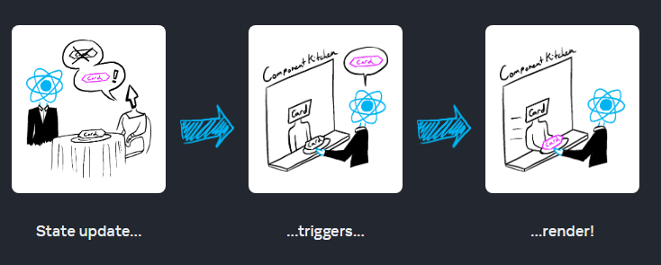

# ⭐ State and Lifecycle

Trong Session này chúng ta tìm hiểu:

===============================

✅ State là gì ?

✅ Khái niệm One-Way / Two-way binding

✅ State và Lifecycle

✅ Cách Update một State

===============================

## 🔥 5.1 State ?

> State: A Component's Memory

State giống như một kho lưu trữ dữ liệu cho các component trong ReactJS. 

Nó chủ yếu được sử dụng để cập nhật các trạng thái của một component khi người dùng thực hiện một số hành động như nhấp vào nút, nhập một số văn bản, nhấn một số phím, v.v. làm thay đổi kết quả hiển thị ra màn hình.

Nó chỉ hoạt động trong phạm vi Component đó thôi


===============================

### 🌻Tại sao lại cần đến State ?

Cùng xem một ví dụ minh họa để thấy sự cần thiết State.


```js
export default function Count() {
  let index = 0;

  function handleClick() {
    index = index + 1;
  }
return (
    <>
      <button onClick={handleClick}>
        Increment
      </button>
      <h3>  
        {index}
      </h3>
     
    </>
  );
}
```

2.Examples\myapp-ts\src\SessionsExamples\session-03-State\NeedState\GalleryNoState.js

2.Examples\myapp-ts\src\SessionsExamples\session-03-State\NeedState\GalleryState.js

### 🌻Khởi tạo một State

Ví dụ có biến count, và một button, khi click Button thì biến count tăng lên 1 giá trị.

```js
import React from 'react';
export default function Count() {
    // Tạo một State count, sử dụng hook useState
    const [count, setCount] = React.useState(0);
    const increase()=> {
        setCount(count + 1);
    }
    return (
        <h1>{count}</h1>
        <button onClick={increase()}>
        Increase 
      </button>
    )
}

```
Cú pháp tạo một State

```js
//const [stateName, setStateName] = React.useState(initialState);
const [count, setCount] = React.useState(0);
```

Bản chất `React.useState(0)` là một function return về một mảng [] có 2 phần tử.

`[count, setCount]` là đang sử dụng cú pháp `Destructuring assignment` của JavaScript
- count: tên của State
- setCount: là phương thức để thay đổi giá trị của State tương ứng


### 🌻Khi nào thì cần đến State

Bất cứ khi nào dữ liệu thay đổi trong một component, State có thể được sử dụng.

- ví dụ: Từ ẩn sang hiện, từ không có thành có... Nói chung là trạng thái lúc đầu khác với lúc sau
- Ví dụ: một form nhập input type text mỗi trường trong Form sẽ giữ lại trạng thái của nó dựa trên dữ liệu đầu vào của người dùng (user input). Nếu đầu vào của người dùng thay đổi, trạng thái của các text input sẽ thay đổi, đây là nguyên nhân cần re-rendering của component và tất cả các component con của nó. Và khi này chúng ta sẽ sử dụng state


### 🌻 State chỉ hoạt động trong phạm vi một Component

Note: gọi component Count trên đây ra 2 lần, để thấy được là dù là một component nhưng trạng thái thì là của riêng. 

===============================

### 🌻 Ví dụ về State

- Button Like
- Button Thả tim
- Button Rating 5 sao
- Modal open/close

Ví dụ về simple todo list

```js
import React, { useState } from 'react';

const ListExample = () => {
  const [items, setItems] = useState([
    { id: 1, text: 'Mua sữa' },
    { id: 2, text: 'Đi chợ' },
    { id: 3, text: 'Làm bài tập' },
  ]);

  const handleAddItem = () => {
    const newItem = { id: items.length + 1, text: 'Việc mới' };
    setItems([...items, newItem]);
  };

  const handleRemoveItem = (id) => {
    const updatedItems = items.filter((item) => item.id !== id);
    setItems(updatedItems);
  };

  return (
    <div>
      <ul>
        {items.map((item) => (
          <li key={item.id}>
            {item.text}
            <button onClick={() => handleRemoveItem(item.id)}>Xóa</button>
          </li>
        ))}
      </ul>
      <button onClick={handleAddItem}>Thêm việc mới</button>
    </div>
  );
};

export default ListExample;

```

## 🔥 5.2 One-Way / Two-way binding


**🌻One-way data binding (ràng buộc dữ liệu một chiều) ?**

- Dữ liệu di chuyển một chiều từ nguồn dữ liệu (thường là state) đến giao diện người dùng.
- Thay đổi dữ liệu trong nguồn dữ liệu sẽ thay đổi dữ liệu trong giao diện tương ứng.
- Chiều duy nhất của data binding là từ nguồn dữ liệu đến giao diện.
- One-way data binding thường được sử dụng trong 
- React thông qua việc truyền dữ liệu từ component cha xuống component con thông qua props.

**🌻Two-way data binding (ràng buộc dữ liệu hai chiều)**

- Dữ liệu có thể di chuyển hai chiều giữa nguồn dữ liệu và giao diện người dùng.
- Khi dữ liệu trong nguồn dữ liệu thay đổi, nó cũng thay đổi trong giao diện và ngược lại, khi dữ liệu trong giao diện thay đổi, nó cũng thay đổi trong nguồn dữ liệu.
- Two-way data binding thường được sử dụng trong một số framework như Angular.


Ví dụ: 2.Examples\myapp-js\src\SessionExamples\session-03-State\UpdateState

===============================

## 🔥 5.3 Khái niệm Lifecycle


🌻 **Re-Render trong React là gì?**

Khi nói về Performances của React, có 2 giai đoạn chính mà chúng ta cần quan tâm:

- **initial render** : Khởi chạy App, React gọi Root Component bằng cách gọi `createRoot` tạo DOM và chạy hàm `render` để render component hiển thị ra màn hình.

- **Re-render** Xảy ra khi React cần update App một số giá trị mới. Thông thường, điều này xảy ra do người dùng tương tác với ứng dụng (events handling) hoặc một số dữ liệu bên ngoài đến thông qua một yêu cầu bất đồng bộ ví dụ như call API lấy data đổ về.

===============================

🌻 **Khi nào và tại sao một component render ?**

Có 2 lí do để 1 component render:

1. Render lần đầu tiên (initial render)

2. State của component hoặc component CHA của nó thay đổi.

===============================

🌻 **Các bước liên quan đến việc hiển thị một thành phần trên màn hình**

Quá trình xử lý yêu cầu tương tác từ giao diện người dùng có 3 bước:

1. Triggering a render (nhận yêu cầu Order từ khách đưa cho nhà bếp) 

2. Rendering the component (nhà bếp chuẩn bị Order) 

3. Committing to the DOM (Mang món ra bàn cho khách)


Chu trình này trong React Component còn được hiểu với một khái niệm đó là **LifeCycle** - Vòng đời của một Component.

- Component được sinh ra  - Gọi món (**Mounting**)
- Component tồn tại và thay đổi - Chuẩn bị Món (**Updation**)
- Component mất đi - Mang món ra cho khách (**Unmounting**)

***

Xem thêm mô hình LifeCycle đối với Class Components: <https://projects.wojtekmaj.pl/react-lifecycle-methods-diagram/>

Xem ví dụ minh họa

Chúng ta sẽ tìm hiểu kỹ hơn các khái niệm này trong bài học về Hook useEffect. Trecking một component để biết khi nào thì nó **Mounting**, khi nào thi nó **Updation**, và khi nào thì nó đã **Unmounting**


Đọc thêm bài viết: <https://viblo.asia/p/lifecycle-component-trong-reactjs-gGJ59jzxKX2>

***

Chi tiết các bước nói trên diễn ra như sau:


🔸**Step 1: Kích hoạt render**

- Initial render

Khởi chạy App, React gọi Root Component bằng cách gọi createRoot tạo DOM và chạy hàm render để render component hiển thị ra màn hình.

Example:

```js
import Image from './Image.js';
import { createRoot } from 'react-dom/client';

const root = createRoot(document.getElementById('root'))
root.render(<Image />);
```

- State update

Một component đã được render trước đó (Initial render), bạn có thể kích hoạt lại quá trình render bằng cách thay đổi State thông qua phương thức `set`

(Bạn có thể tưởng tượng những điều này giống như một vị khách của nhà hàng gọi trà, món tráng miệng và đủ thứ nữa sau khi gọi món đầu tiên, tùy thuộc vào tình trạng khát hay đói của họ.)



🔸**Step 2: React render component của bạn**

Sau khi kích hoạt một render, React gọi đến component lấy nội dung hiển thị ra màn hình. Thuật ngữ **"Rendering"** nghĩa là React đang gọi đến component của bạn.

- Trong lần render đầu tiên (initial render): 

    + React sẽ gọi root component
    + React sẽ tạo các DOM Node

- Các lần render tiếp theo: 

  + React gọi đến function component có State thay đổi đã kích hoạt render. 
  + React sẽ tính toán so sánh các thuộc tính của chúng (state), nếu không có bất kỳ thay đổi nào kể từ lần render trước đó thì React bỏ qua và đến giai đoạn tiếp theo Commit.

🔸Step 3: React cập nhật thay đổi đến DOM

- Trong lần render đầu tiên (initial render): React sử dụng phương thức `appendChild()` DOM API để đặt tất cả các DOM nodes mà nó đã tạo vào `<div id="root">` để hiển thị ra màn hình.
    
- Re-renders: 
  - React tạo ra virtual DOM. React sẽ sử dụng thuật toán **Diffing** để nhận biết được đã có điều gì khác hoặc thay đổi trong virtual DOM.
  - Bước tiếp theo là Reconciliation. Ở bước này, virtual DOM sẽ được cập nhật lại với kết quả khác sau khi sử dụng thuật toán Diffing ở bước đầu tiên.
  - React chỉ update lại những gì thay đổi vào "real" DOM (DOM thật).

🔸Step 4 Kết - Commit: Vẽ lại trình duyệt

Sau khi rendering xong and React updated lại DOM, trình duyệt vẽ lại màn hình. 

===============================

**Ví dụ chứng minh React chỉ update lại những thay đổi cần thiết**

```js
//App.js
 
 function App() {
 
  console.log("Parent rendered");
  return (
    <div className="wrap">
        <h1>Parent Component</h1>
        <div>-----------------</div>
        <Child />
    </div>
  );
}

// Chỉ có biến count thay đổi ở Child
// Check console để xem
function Child({name}: {name: string}){
   const [count,setCount]=useState<number>(0);
    console.log("Child Rendered");
    return(
        <div>
            <h1>Child Component {name}</h1>
            <button onClick={()=>setCount(count+1)}>
            Increase
            </button>
            <p>Count:{count}</p>
    </div>
    );
}
 
export default App;

```

>`Xem thêm: Khi nào thì React component re-renders lại chính nó ?`

> View: <https://www.developerway.com/posts/react-re-renders-guide>

===============================

**Tại sao cần phải nắm chắc khi nào thì một Component Re-render?**

- Để ngăn Component re-render khi không cần thiết
- Tối ưu performance, app chạy nhanh hơn.


===============================

## 🔥 5.3 State là một Snapshot

Giống như mỗi giây thời gian trôi qua, bạn không thể lấy lại được. 

State cũng vậy, mỗi lần Component render thì nó tạo ra `một giá trị tham chiếu` MỚI hay còn gọi là Snapshot (một ảnh chụp) tại thời điểm đó.

### 🌻 5.3.1 Thay đổi State kích hoạt Render

Xem ví dụ: <https://react.dev/learn/state-as-a-snapshot#setting-state-triggers-renders>


Điều gì xảy ra khi bạn click vào button Send:

- Form sẽ submit thông qua sự kiện onSubmit.
- setIsSent(true) set lại isSent =  true và tạo hàng đợi để re-render mới.
- React sẽ re-renders lại component theo giá trị isSent mới.

### 🌻 5.3.2 Rendering takes a snapshot in time

“Rendering” nghĩa là React đang gọi component của bạn, sử dụng function component. JSX trả lại từ function như là một bản chụp  **snapshot** của UI tại thời điểm đó. Bao gồm: các props, event handlers, local variables, tất cả các calculated sử dụng state tại thời điểm render.

Khi React re-renders lai một component:

- React gọi đến component function một lần nữa.
- function trả lại một JSX snapshot mới.
- React sau đó update màn hình để khớp với snapshot mà bạn trả lại.


Chi tiết hơn


Ví dụ để hiểu Snapshot State

<https://react.dev/learn/state-as-a-snapshot#rendering-takes-a-snapshot-in-time>

<https://react.dev/learn/state-as-a-snapshot#state-over-time>


===============================

## 🔥 5.4 State Updates

### 🌻 5.4.1 Khái niệm `queue` = hàng đợi

- Details: <https://beta.reactjs.org/learn/queueing-a-series-of-state-updates>
- Làm rõ vấn đề cách update State

```js
// 4 cách set giá trị mới cho một State
setNumber(42);
setNumber(number + 5);
setNumber(prev => prev + 1);
setEnabled(e => !e);

```

### 🌻 5.4.2 State là một Object

Khi state là một Object thì ta update như sau
```js
//App.js
import { useState } from 'react';

export default function Form() {
  const [person, setPerson] = useState({
    firstName: 'Barbara',
    lastName: 'Hepworth',
    email: 'bhepworth@sculpture.com'
  });

  //Method 1:
  setPerson({
    firstName: 'Alexander', 
    lastName: 'Brahma',
    email: 'alexander@gmail.com'
    });
  //Method 2: ... object spread syntax 
  setPerson({
    ...person, // Copy the old fields
    firstName: 'Alexander' // But override this one
    });
}
```

View details: <https://react.dev/learn/updating-objects-in-state>

===============================

### 🌻 5.4.3 State là một Mảng

>`Updating arrays without mutation`

Dưới đây là một bảng so sánh phương thức mảng. Khi bạn thao tác với mảng trong React State, bạn cần tránh sử dụng các phương thức bên cột trái, nên sử dụng phương thức bên cột phải để thay thế.

|              |      avoid (mutates the array)        | prefer (returns a new array)     |
| :------------:|:-------------:|:-----:|
|  **adding**   |   `push`, `unshift`   |  concat, [...arr] spread syntax    |
|  **removing** |   `pop`, `shift`, `splice`   |   `filter`, `slice`   |
|  **replacing**   | `splice`, `arr[i] = ... assignment` |  `map`  |
|  **sorting**  | `reverse`, `sort`  |  copy the array first  |


- Thêm phần tử vào mảng:

View details: <https://react.dev/learn/updating-arrays-in-state#adding-to-an-array>

```js
//Lúc đầu giá trị mặc định là mảng rỗng
const [artists, setArtists] = useState([]);

//Thêm giá trị mới vào mảng

setArtists( 
  [ 
    ...artists, // that contains all the old items
    { id: nextId++, name: name } // and one new item at the end
  ]
);

```

- Xóa phần tử của mảng:

Xem: <https://react.dev/learn/updating-arrays-in-state#removing-from-an-array>

```js
import { useState } from 'react';


//Mảng giá trị mặc định
let initialArtists = [
  { id: 0, name: 'Marta Colvin Andrade' },
  { id: 1, name: 'Lamidi Olonade Fakeye'},
  { id: 2, name: 'Louise Nevelson'},
];

export default function List() {
  const [artists, setArtists] = useState(
    initialArtists
  );

  return (
    <>
      <h1>Inspiring sculptors:</h1>
      <ul>
        {artists.map(artist => (
          <li key={artist.id}>
            {artist.name}{' '}
            <button onClick={() => {
              setArtists(
                artists.filter(a =>
                  a.id !== artist.id
                )
              );
            }}>
              Delete
            </button>
          </li>
        ))}
      </ul>
    </>
  );
}

```
Khi click nút Delete, thì sẽ xóa đi item có ID tương ứng.

```js
//Bản chất là chỉ lọc và giữ lại những ID khác với ID đã xóa
setArtists(
  artists.filter(a => a.id !== artist.id)
);
```


- Biến đổi phần tử mảng: 

<https://react.dev/learn/updating-arrays-in-state#transforming-an-array>

- Thay thế phần tử mảng:

<https://react.dev/learn/updating-arrays-in-state#replacing-items-in-an-array>

- Chèn một phần tử vào mảng:

<https://react.dev/learn/updating-arrays-in-state#inserting-into-an-array>

- Thay đổi một Object trong một mảng

<https://react.dev/learn/updating-arrays-in-state#making-other-changes-to-an-array>


===============================

## Khai báo kiểu dữ liệu của State trong TypeScript

```js
interface PersonProps {
  name: string;
  age: number;
  hobbies: Array<string>;
  isCool: boolean;
}

// Boolean type
const [isCool] = React.useState<boolean>(true);

// String type
const [name] = React.useState<string>('Ruben');

// Number type
const [age] = React.useState<number>(28);

// Null or undefined
const [random] = React.useState<null | undefined>();

// Array of string 
const [hobbies] = React.useState<Array<string>>(['soccer', 'cooking', 'code']);

// Custom interface
const [person] = React.useState<PersonProps>({
  isCool,
  name,
  age,
  hobbies
});

```

Tham khảo thêm: 

- https://react-typescript-cheatsheet.netlify.app/docs/basic/getting-started/basic_type_example/

- https://github.com/typescript-cheatsheets/react#reacttypescript-cheatsheets