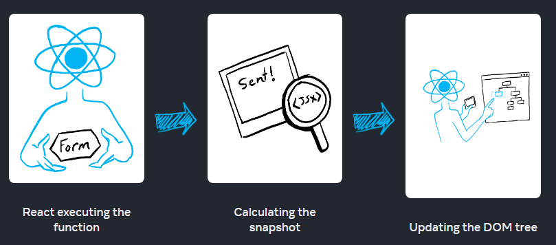
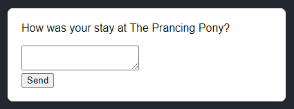
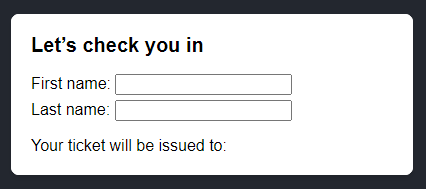
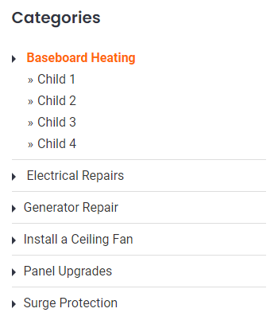

# ⭐ State and Lifecycle

Trong Session này chúng ta tìm hiểu:

===============================

✅ State là gì ?

✅ Khái niệm One-Way / Two-way binding

✅ State và Lifecycle

✅ Cách Update một State

===============================

## 🔥 6.1 State ?

> State: A Component's Memory

State giống như một kho lưu trữ dữ liệu cho các component trong ReactJS. 

Nó chủ yếu được sử dụng để cập nhật các trạng thái của một component khi người dùng thực hiện một số hành động như nhấp vào nút, nhập một số văn bản, nhấn một số phím, v.v. làm thay đổi kết quả hiển thị ra màn hình.

Nó chỉ hoạt động trong phạm vi Component đó thôi


===============================

### 🌻Tại sao lại cần đến State ?

Cùng xem một ví dụ minh họa để thấy sự cần thiết State.


```js
export default function Count() {
  let index = 0;

  function handleClick() {
    index = index + 1;
  }
return (
    <>
      <button onClick={handleClick}>
        Increment
      </button>
      <h3>  
        {index}
      </h3>
     
    </>
  );
}
```

2.Examples\myapp-ts\src\SessionsExamples\session-03-State\NeedState\GalleryNoState.js

2.Examples\myapp-ts\src\SessionsExamples\session-03-State\NeedState\GalleryState.js

### 🌻Khởi tạo một State

Ví dụ có biến count, và một button, khi click Button thì biến count tăng lên 1 giá trị.

```js
import React from 'react';
export default function Count() {
    // Tạo một State count, sử dụng hook useState
    const [count, setCount] = React.useState(0);
    const increase()=> {
        setCount(count + 1);
    }
    return (
        <h1>{count}</h1>
        <button onClick={increase()}>
        Increase 
      </button>
    )
}

```
Cú pháp tạo một State

```js
//const [stateName, setStateName] = React.useState(initialState);
const [count, setCount] = React.useState(0);
```

Bản chất `React.useState(0)` là một function return về một mảng [] có 2 phần tử.

`[count, setCount]` là đang sử dụng cú pháp `Destructuring assignment` của JavaScript
- count: tên của State
- setCount: là phương thức để thay đổi giá trị của State tương ứng


### 🌻Khi nào thì cần đến State

Bất cứ khi nào dữ liệu thay đổi trong một component, State có thể được sử dụng.

- ví dụ: Từ ẩn sang hiện, từ không có thành có... Nói chung là trạng thái lúc đầu khác với lúc sau
- Ví dụ: một form nhập input type text mỗi trường trong Form sẽ giữ lại trạng thái của nó dựa trên dữ liệu đầu vào của người dùng (user input). Nếu đầu vào của người dùng thay đổi, trạng thái của các text input sẽ thay đổi, đây là nguyên nhân cần re-rendering của component và tất cả các component con của nó. Và khi này chúng ta sẽ sử dụng state


### 🌻 State chỉ hoạt động trong phạm vi một Component

Note: gọi component Count trên đây ra 2 lần, để thấy được là dù là một component nhưng trạng thái thì là của riêng. 

===============================

### 🌻 Ví dụ về State

- Button Like
- Button Thả tim
- Button Rating 5 sao

## 🔥 6.2 One-Way / Two-way binding

Trong React nó có 2 chiều,

1: là chiều tương tác từ giao diện người dùng.

2: là chiều thay đổi dữ liệu (State) từ trong component

**🌻One-Way binding là gì ?**

Nếu 1 trong 2 chiều trên thay đổi, mà chiều cọn lại không thay đổi thì gọi là dữ liệu 1 chiều - One-Way binding

**🌻Two-way binding là gì ?**

Ngược lại nếu thay đổi 1 trong 2 chiều mà chiều còn lại cũng thay đổi theo thì gọi là Two-Way binding

Ví dụ: 2.Examples\myapp-js\src\SessionExamples\session-03-State\UpdateState

===============================

## 🔥 6.3 Khái niệm Lifecycle

> Render and Commit

Trước khi component hiển thị ra màn hình, chúng phải được render bới React. Bạn cần nắm các bước trong quá trình xử lý để giúp bạn hiểu được làm thế nào để code chạy và giải thích các hành vi của nó.


🌻 **Re-Render trong React là gì?**

Khi nói về Performances của React, có 2 giai đoạn chính mà chúng ta cần quan tâm:

- **initial render** : Khởi chạy App, React gọi Root Component bằng cách gọi `createRoot` tạo DOM và chạy hàm `render` để render component hiển thị ra màn hình.

- **Re-render** Xảy ra khi React cần update App một số giá trị mới. Thông thường, điều này xảy ra do người dùng tương tác với ứng dụng (events handling) hoặc một số dữ liệu bên ngoài đến thông qua một yêu cầu bất đồng bộ ví dụ như call API lấy data đổ về.

===============================

🌻 **Khi nào và tại sao một component render ?**

Có 2 lí do để 1 component render:

1. Render lần đầu tiên (initial render)

2. State của component hoặc component CHA của nó thay đổi.

===============================

🌻 **Các bước liên quan đến việc hiển thị một thành phần trên màn hình**

Quá trình xử lý yêu cầu tương tác từ giao diện người dùng có 3 bước:

1. Triggering a render (nhận yêu cầu Order từ khách đưa cho nhà bếp) 

2. Rendering the component (nhà bếp chuẩn bị Order) 

3. Committing to the DOM (Mang món ra bàn cho khách)


Chu trình này trong React Component còn được hiểu với một khái niệm đó là **LifeCycle** - Vòng đời của một Component.

- Component được sinh ra (**Mounting**)
- Component tồn tại và thay đổi (**Updation**)
- Component mất đi (**Unmounting**)

***

Xem thêm mô hình LifeCycle đối với Class Components: <https://projects.wojtekmaj.pl/react-lifecycle-methods-diagram/>

Xem ví dụ minh họa

Chúng ta sẽ tìm hiểu kỹ hơn các khái niệm này trong bài học về Hook useEffect. Trecking một component để biết khi nào thì nó **Mounting**, khi nào thi nó **Updation**, và khi nào thì nó đã **Unmounting**


Đọc thêm bài viết: <https://viblo.asia/p/lifecycle-component-trong-reactjs-gGJ59jzxKX2>

===========================

🔸**Step 1: Kích hoạt render**

- Initial render

Khởi chạy App, React gọi Root Component bằng cách gọi createRoot tạo DOM và chạy hàm render để render component hiển thị ra màn hình.

Example:

```js
import Image from './Image.js';
import { createRoot } from 'react-dom/client';

const root = createRoot(document.getElementById('root'))
root.render(<Image />);
```

- State update

Một component đã được render trước đó (Initial render), bạn có thể kích hoạt lại quá trình render bằng cách thay đổi State thông qua phương thức `set`

(Bạn có thể tưởng tượng những điều này giống như một vị khách của nhà hàng gọi trà, món tráng miệng và đủ thứ nữa sau khi gọi món đầu tiên, tùy thuộc vào tình trạng khát hay đói của họ.)


🔸**Step 2: React render component của bạn**

Sau khi kích hoạt một render, React gọi đến component lấy nội dung hiển thị ra màn hình. Thuật ngữ **"Rendering"** nghĩa là React đang gọi đến component của bạn.

- Trong lần render đầu tiên (initial render): 

    + React sẽ gọi root component
    + React sẽ tạo các DOM Node

- Các lần render tiếp theo: 

  + React gọi đến function component có State thay đổi đã kích hoạt render. 
  + React sẽ tính toán so sánh các thuộc tính của chúng (state), nếu không có bất kỳ thay đổi nào kể từ lần render trước đó thì React bỏ qua và đến giai đoạn tiếp theo Commit.

🔸Step 3: React cập nhật thay đổi đến DOM

- Trong lần render đầu tiên (initial render): React sử dụng phương thức `appendChild()` DOM API để đặt tất cả các DOM nodes mà nó đã tạo vào `<div id="root">` để hiển thị ra màn hình.
    
- Re-renders: 
  - React tạo ra virtual DOM. React sẽ sử dụng thuật toán **Diffing** để nhận biết được đã có điều gì khác hoặc thay đổi trong virtual DOM.
  - Bước tiếp theo là Reconciliation. Ở bước này, virtual DOM sẽ được cập nhật lại với kết quả khác sau khi sử dụng thuật toán Diffing ở bước đầu tiên.
  - React chỉ update lại những gì thay đổi vào "real" DOM (DOM thật).

🔸Step 4 Kết - Commit: Vẽ lại trình duyệt

Sau khi rendering xong and React updated lại DOM, trình duyệt vẽ lại màn hình. 

===============================

**Ví dụ chứng minh React chỉ update lại những thay đổi cần thiết**

```js
//App.js
 
 function App() {
 
  console.log("Parent rendered");
  return (
    <div className="wrap">
        <h1>Parent Component</h1>
        <div>-----------------</div>
        <Child />
    </div>
  );
}

// Chỉ có biến count thay đổi ở Child
// Check console để xem
function Child({name}: {name: string}){
   const [count,setCount]=useState<number>(0);
    console.log("Child Rendered");
    return(
        <div>
            <h1>Child Component {name}</h1>
            <button onClick={()=>setCount(count+1)}>
            Increase
            </button>
            <p>Count:{count}</p>
    </div>
    );
}
 
export default App;

```

>`Xem thêm: Khi nào thì React component re-renders lại chính nó ?`

> View: <https://www.developerway.com/posts/react-re-renders-guide>

===============================

**Tại sao cần phải nắm chắc khi nào thì một Component Re-render?**

- Để ngăn Component re-render khi không cần thiết
- Tối ưu performance, app chạy nhanh hơn.


===============================

## 🔥 6.3 State là một Snapshot

Giống như mỗi giây thời gian trôi qua, bạn không thể lấy lại được. 

State cũng vậy, mỗi lần Component render thì nó tạo ra `một giá trị tham chiếu` MỚI hay còn gọi là Snapshot (một ảnh chụp) tại thời điểm đó.

### 🌻 6.3.1 Thay đổi State kích hoạt Render

Xem ví dụ: <https://react.dev/learn/state-as-a-snapshot#setting-state-triggers-renders>


Điều gì xảy ra khi bạn click vào button Send:

- Form sẽ submit thông qua sự kiện onSubmit.
- setIsSent(true) set lại isSent =  true và tạo hàng đợi để re-render mới.
- React sẽ re-renders lại component theo giá trị isSent mới.

### 🌻 6.3.2 Rendering takes a snapshot in time

“Rendering” nghĩa là React đang gọi component của bạn, sử dụng function component. JSX trả lại từ function như là một bản chụp  **snapshot** của UI tại thời điểm đó. Bao gồm: các props, event handlers, local variables, tất cả các calculated sử dụng state tại thời điểm render.

Khi React re-renders lai một component:

- React gọi đến component function một lần nữa.
- function trả lại một JSX snapshot mới.
- React sau đó update màn hình để khớp với snapshot mà bạn trả lại.



Chi tiết hơn


Ví dụ để hiểu Snapshot State

<https://react.dev/learn/state-as-a-snapshot#rendering-takes-a-snapshot-in-time>

<https://react.dev/learn/state-as-a-snapshot#state-over-time>


===============================

## 🔥 6.4 State Updates

### 🌻 6.4.1 Khái niệm `queue` = hàng đợi

- Details: <https://beta.reactjs.org/learn/queueing-a-series-of-state-updates>
- Làm rõ vấn đề cách update State

```js
// 4 cách set giá trị mới cho một State
setNumber(42);
setNumber(number + 5);
setNumber(prev => prev + 1);
setEnabled(e => !e);

```

### 🌻 6.4.2 State là một Object

Khi state là một Object thì ta update như sau
```js
//App.js
import { useState } from 'react';

export default function Form() {
  const [person, setPerson] = useState({
    firstName: 'Barbara',
    lastName: 'Hepworth',
    email: 'bhepworth@sculpture.com'
  });

  //Method 1:
  setPerson({
    firstName: 'Alexander', 
    lastName: 'Brahma',
    email: 'alexander@gmail.com'
    });
  //Method 2: ... object spread syntax 
  setPerson({
    ...person, // Copy the old fields
    firstName: 'Alexander' // But override this one
    });
}
```

View details: <https://react.dev/learn/updating-objects-in-state>

===============================

### 🌻 6.4.3 State là một Mảng

>`Updating arrays without mutation`

Dưới đây là một bảng so sánh phương thức mảng. Khi bạn thao tác với mảng trong React State, bạn cần tránh sử dụng các phương thức bên cột trái, nên sử dụng phương thức bên cột phải để thay thế.

|              |      avoid (mutates the array)        | prefer (returns a new array)     |
| :------------:|:-------------:|:-----:|
|  **adding**   |   `push`, `unshift`   |  concat, [...arr] spread syntax    |
|  **removing** |   `pop`, `shift`, `splice`   |   `filter`, `slice`   |
|  **replacing**   | `splice`, `arr[i] = ... assignment` |  `map`  |
|  **sorting**  | `reverse`, `sort`  |  copy the array first  |


- Thêm phần tử vào mảng:

View details: <https://react.dev/learn/updating-arrays-in-state#adding-to-an-array>

```js
//Lúc đầu giá trị mặc định là mảng rỗng
const [artists, setArtists] = useState([]);

//Thêm giá trị mới vào mảng

setArtists( 
  [ 
    ...artists, // that contains all the old items
    { id: nextId++, name: name } // and one new item at the end
  ]
);

```

- Xóa phần tử của mảng:

Xem: <https://react.dev/learn/updating-arrays-in-state#removing-from-an-array>

```js
import { useState } from 'react';


//Mảng giá trị mặc định
let initialArtists = [
  { id: 0, name: 'Marta Colvin Andrade' },
  { id: 1, name: 'Lamidi Olonade Fakeye'},
  { id: 2, name: 'Louise Nevelson'},
];

export default function List() {
  const [artists, setArtists] = useState(
    initialArtists
  );

  return (
    <>
      <h1>Inspiring sculptors:</h1>
      <ul>
        {artists.map(artist => (
          <li key={artist.id}>
            {artist.name}{' '}
            <button onClick={() => {
              setArtists(
                artists.filter(a =>
                  a.id !== artist.id
                )
              );
            }}>
              Delete
            </button>
          </li>
        ))}
      </ul>
    </>
  );
}

```
Khi click nút Delete, thì sẽ xóa đi item có ID tương ứng.

```js
//Bản chất là chỉ lọc và giữ lại những ID khác với ID đã xóa
setArtists(
  artists.filter(a => a.id !== artist.id)
);
```


- Biến đổi phần tử mảng: 

<https://react.dev/learn/updating-arrays-in-state#transforming-an-array>

- Thay thế phần tử mảng:

<https://react.dev/learn/updating-arrays-in-state#replacing-items-in-an-array>

- Chèn một phần tử vào mảng:

<https://react.dev/learn/updating-arrays-in-state#inserting-into-an-array>

- Thay đổi một Object trong một mảng

<https://react.dev/learn/updating-arrays-in-state#making-other-changes-to-an-array>


===============================

## 🔥 6.5 Managing State (Advanced)

Các cách nâng cao để bạn tối ưu và quản lý State đúng và hiệu suất.

View details: <https://react.dev/learn/managing-state>


### 6.5.1 Reacting to Input with State

>Đưa ra các phản ứng khi thao tác form input với State


Khi làm việc với React liên quan đến vấn đề tương tác người dùng. Bạn phải nắm được các hành vi, các vấn đề có thể xay ra xung quang một sự kiện tương tác từ người dùng.


Như ví dụ trên:

- Lúc đầu input là empty
- Khi chưa điền số điện thoại vào chúng ta muốn là nút Đăng ký không thể click được (disable)
- Khi chúng ta điền số điện thoại vào thì button Đăng ký mới cho phép click
- Rồi khi chúng ta click một cái thì phải disable ngay, để tránh người dùng click nhiều lần. 
- Sau sau khi click thì lại có thêm 2 trạng thái có thể xảy ra
  - Thành công
  - Thất bại, có lỗi

Thì chúng ta các trạng thái State tương ứng với từng vấn đề trên như sau:

```js
const [isEmpty, setIsEmpty] = useState(true);
const [isTyping, setIsTyping] = useState(false);
const [isSubmitting, setIsSubmitting] = useState(false);
const [isSuccess, setIsSuccess] = useState(false);
const [isError, setIsError] = useState(false);
```

Áp dụng vào ví dụ trên.

```js
import { useState } from 'react';

export default function CallForm() {
  const [mobile, setMobile] = useState('');
  const [error, setError] = useState(null);
  const [status, setStatus] = useState('typing');

  if (status === 'success') {
    return <h1>That's right!</h1>
  }

  async function handleSubmit(e) {
    e.preventDefault();
    setStatus('submitting');
    try {
      await submitForm(mobile);
      setStatus('success');
    } catch (err) {
      setStatus('typing');
      setError(err);
    }
  }

  function handleInputChange(e) {
    setMobile(e.target.value);
  }

  return (
    <>
      <h2>City quiz</h2>
      <p>
        In which city is there a billboard that turns air into drinkable water?
      </p>
      <form onSubmit={handleSubmit}>
        <input
          value={mobile}
          onChange={handleInputChange}
          disabled={status === 'submitting'}
        />
        <br />
        <button disabled={
          mobile.length === 0 ||
          status === 'submitting'
        }>
          Đăng ký
        </button>
        {error !== null &&
          <p className="Error">
            {error.message}
          </p>
        }
      </form>
    </>
  );
}

function submitForm(mobile) {
  // Pretend it's hitting the network.
  return new Promise((resolve, reject) => {
    setTimeout(() => {
      let shouldError = mobile.length > 0 && mobile.length !== 10;
      if (shouldError) {
        reject(new Error('Số điện thoại không hợp lệ'));
      } else {
        resolve();
      }
    }, 1500);
  });
}


```


### 6.5.2 Choosing the State Structure

>Lựa chọn cấu trúc hợp lý cho State

**Các nguyên tắc để tạo ra một cấu trúc State CHUẨN**

1. [Group related state](https://react.dev/learn/choosing-the-state-structure#group-related-state) (Nhóm các State liên quan).

 Nếu bạn luôn update hai hoặc nhiều State cùng một lúc thì nên gộp chúng lại thành một State duy nhất bằng cách dùng Object

Ví dụ:

```js
const [x, setX] = useState(0);
const [y, setY] = useState(0);
```

Thay thế bằng

```js
const [position, setPosition] = useState({ x: 0, y: 0 });
```


2. [Avoid contradictions in state](https://react.dev/learn/choosing-the-state-structure#avoid-contradictions-in-state). (Tránh tạo ra sự hiểu nhầm giữa các State)

Ví dụ bạn có một khung chát



```js
const [text, setText] = useState('');
  const [isSending, setIsSending] = useState(false);
  const [isSent, setIsSent] = useState(false);

  async function handleSubmit(e) {
    e.preventDefault();
    setIsSending(true);
    await sendMessage(text);
    setIsSending(false);
    setIsSent(true);
  }
```

Gây ra sự nhập nhằng không biết lúc nào thì Đang gửi, lúc nào thì đã gửi.

Giải pháp là hãy tạo ra một State status trạng thái duy nhất

```js
const [text, setText] = useState('');
const [status, setStatus] = useState('typing');

  async function handleSubmit(e) {
    e.preventDefault();
    setStatus('sending');
    await sendMessage(text);
    setStatus('sent');
  }
```

3. [Avoid redundant state](https://react.dev/learn/choosing-the-state-structure#avoid-redundant-state) (Tránh tình trạng dư thừa)

Ví dụ có một form cần điền vào 2 trường



Sau đó xuất ra Fullname ở bên dưới

Có thể bạn nghĩ sẽ cần đến 3 State để làm được việc này

```js
const [firstName, setFirstName] = useState('');
const [lastName, setLastName] = useState('');
const [fullName, setFullName] = useState('');
```
Nhưng không, cách dưới đây giúp bạn bớt đi một State

```js
const [firstName, setFirstName] = useState('');
const [lastName, setLastName] = useState('');

const fullName = firstName + ' ' + lastName;
```

Bạn chỉ cần lấy fullname đưa ra hiển thị

4. [Avoid duplication in state](https://react.dev/learn/choosing-the-state-structure#avoid-duplication-in-state) (Tránh trùng lặp State)

Ví dụ có một Danh sách Menu như hình


Được tạo ra từ một Object arrays

```js
const initialItems = [
  { title: 'pretzels', id: 0 },
  { title: 'crispy seaweed', id: 1 },
  { title: 'granola bar', id: 2 },
];
//items nhận initialItems làm giá trị khởi tạo
const [items, setItems] = useState(initialItems);
//selectedItem mặc định là giá trị đầu tiên trong mảng items
const [selectedItem, setSelectedItem] = useState(
    items[0]
  );
```

Khi bạn dùng cách này thì bạn đang gặp vấn đề về trùng lặp State.

- selectedItem là một một object, là phần tử thứ 0 của items
- Rồi trong items cũng có phần tử thứ 0 đó nữa

==> Phần tử thứ 0 đang lặp lại chính nó ở 2 nơi.

Giải pháp khắc phục

```js
const [items, setItems] = useState(initialItems);
//State lưu trữ id của item được chọn
const [selectedId, setSelectedId] = useState(0);

//Bằng cách sử dụng find() bạn có thể xác định được phần tử nào được chọn
//dựa vào selectedId
const selectedItem = items.find(item =>
    item.id === selectedId
);
```

5. [Avoid deeply nested state](https://react.dev/learn/choosing-the-state-structure#avoid-deeply-nested-state) (Tránh dùng State có độ sâu)

Có nghĩa là một State là một Object có nhiều lớp con


### 6.5.3 Sharing State Between Components

>Tương tác State giữa các components với nhau

Như chúng ta biết State là trạng thái chỉ tồn tại bên trong một component

Ví dụ về Categories Accordion 5.Demo-Projects/blog.html



Một thời điểm chỉ show được danh mục con của một danh mục CHA

```js
import { useState } from 'react';

function Child({ title, children }) {
  const [isActive, setIsActive] = useState(false);
  return (
    <li>
      <h3 onClick={() => setIsActive(true)}>{title}</h3>
      {isActive && (
        <div className="cate_childs">{children}</div>
      )}
    </li>
  );
}

export default function Categories() {
  return (
    <ul className="categories">
      <Child title="Baseboard Heating">
        <p>Child 1</p>
        <p>Child 2</p>
        <p>Child 3</p>
      </Child>
      <Child title="Electrical Repairs">
        <p>Child 1</p>
        <p>Child 2</p>
        <p>Child 3</p>
      </Child>
    </ul>
  );
}
```

Với cách code trên thì Child nào thì trạng thái đó, có thể show danh mục con của từng danh mục CHA.

Nhưng mong muốn là mỗi lần click Child, thì chỉ Child này mới show danh mục con, còn lại phải ẩn.

```js
import { useState } from 'react';

export default function Categories() {
  const [activeIndex, setActiveIndex] = useState(0);

  return (
    <ul className="categories">
      <Child 
      title="Baseboard Heating"
      isActive={activeIndex === 0}
      onShow={() => setActiveIndex(0)}
      >
        <p>Child 1</p>
        <p>Child 2</p>
        <p>Child 3</p>
      </Child>
      <Child 
      title="Electrical Repairs"
      isActive={activeIndex === 1}
      onShow={() => setActiveIndex(1)}
      >
        <p>Child 1</p>
        <p>Child 2</p>
        <p>Child 3</p>
      </Child>
    </ul>
  );
}

function Child({ title, children, onShow }) {
 
  return (
    <li>
      <h3 onClick={onShow}>{title}</h3>
      {isActive && (
        <div className="cate_childs">{children}</div>
      )}
    </li>
  );
}

```

Chuyển State từ Child ra cho CHA (Categories) khi đó CHA chỉ có một trạng thái duy nhất là `activeIndex` quyết định Child nào sẽ được show.

Nhắc lại: State là trạng thái chỉ tồn tại bên trong một component

Vậy để làm sao chúng ta click vào Child mà có thể update được State `activeIndex` ở components Categories ?

- ở Child thêm vào một props onShow, onShow nhận vào một function (callback function)
- Đem props onShow gán vào sự kiện onClick của Child
- Khi Click thì function này được gọi, gọi thì nó đi chạy `setActiveIndex`
- Cuối cùng là đứng từ Child, chúng ta có thể giao tiếp được với state của component Categories 

==> Chúng ta gọi đó là: Sharing State Between Components


### 6.5.4 Preserving and Resetting State

>Bảo toàn và khôi phục State

Xem chi tiết <https://react.dev/learn/preserving-and-resetting-state>


### 6.5.5 Extracting State Logic into a Reducer

>Chuyển logic xử lý State sang Reducer

Xem chi tiết <https://react.dev/learn/extracting-state-logic-into-a-reducer>

### 6.5.6 Passing Data Deeply with Context

>Truyền Data tới các Components lòng vào nhau sâu với Context

Xem chi tiết <https://react.dev/learn/passing-data-deeply-with-context>