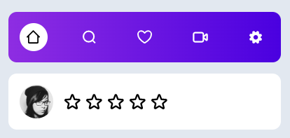

# Bài tập Bắt buộc tầm trung

Làm UI như hình.

- Đối với Thanh Navigation click vào thì focus actived vào Menu đó 
- Đối với xếp sao, click ở đâu thì sao đổi sang màu vàng sao chổ đó (Ví dụ, click sao thứ 3 thì 3 sao đầu tiên sáng lên), click một lần nữa thì hủy.
 

