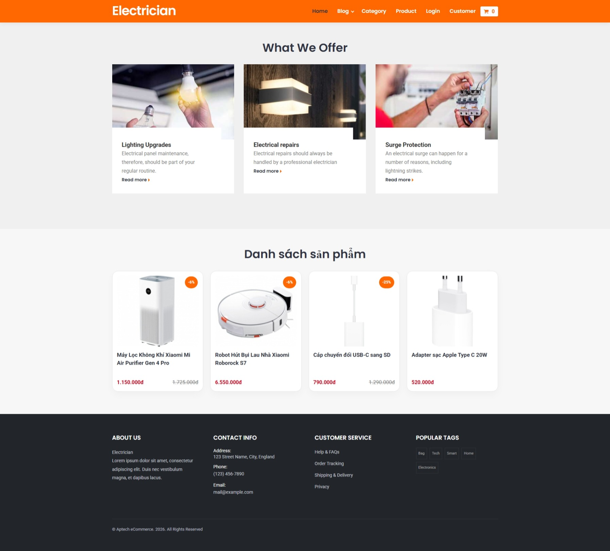

# Yêu cầu triển khai layout bằng React + TypeScript

Hãy xây dựng lại giao diện trang chủ của website thương mại điện tử theo mẫu HTML đang có, nhưng chuyển sang React + TypeScript với cấu trúc component rõ ràng, dễ mở rộng và dễ bảo trì.



## 1. Mục tiêu

Tạo một trang Home Page cho website e-commerce theo phong cách tối giản, hiện đại và chuyên nghiệp, với màu chủ đạo là cam và đậm, phù hợp với giao diện mẫu hiện có.

## 2. Các phần cần có trên trang

### 2.1 Header

- Logo bên trái
- Menu điều hướng bên phải
- Có menu có dropdown cho mục Blog
- Icon giỏ hàng ở bên phải
- Home là menu active
- Responsive: trên mobile menu có thể thu gọn

### 2.2 Section: What We Offer

- Tiêu đề: "What We Offer"
- Hiển thị 3 card dịch vụ
- Mỗi card gồm:
  - hình ảnh
  - tiêu đề
  - mô tả ngắn
  - nút "Read more"
- Card có khoảng cách đẹp, viền nhẹ, hover rõ ràng

### 2.3 Section: Danh sách sản phẩm

- Tiêu đề: "Danh sách sản phẩm"
- Hiển thị 4 sản phẩm trong 1 hàng
- Mỗi sản phẩm có:
  - ảnh sản phẩm
  - nhãn giảm giá nếu có
  - tên sản phẩm
  - giá hiện tại
  - giá cũ nếu có
- Layout responsive:
  - desktop: 4 cột
  - tablet: 2 cột
  - mobile: 1 cột

### 2.4 Footer

- Chia thành 4 cột:
  - About Us
  - Contact Info
  - Customer Service
  - Popular Tags
- Có phần copyright ở cuối
- Footer cần gọn hơn, tối giản nhưng vẫn đủ thông tin cho website e-commerce

## 3. Yêu cầu kỹ thuật

- Sử dụng React + TypeScript
- Chia layout thành các component nhỏ:
  - `Header`
  - `OfferSection`
  - `OfferCard`
  - `ProductSection`
  - `ProductCard`
  - `Footer`
  - `App` hoặc `HomePage`
- Dữ liệu sản phẩm và dịch vụ phải được lưu dưới dạng array object
- Dùng `interface` hoặc `type` để định nghĩa dữ liệu
- Code phải rõ ràng, dễ đọc, dễ mở rộng
- Không cần dùng thư viện ngoài nếu không cần thiết
- Có thể sử dụng CSS module hoặc file CSS riêng

## 4. Định nghĩa dữ liệu mẫu

```ts
type Offer = {
  id: number;
  title: string;
  description: string;
  image: string;
};

type Product = {
  id: number;
  name: string;
  image: string;
  price: number;
  oldPrice?: number;
  discount?: number;
};
```

## 5. Mẫu dữ liệu đề xuất

```ts
const offers = [
  {
    id: 1,
    title: 'Lighting Upgrades',
    description: 'Electrical panel maintenance...',
    image: 'images/lighting-upgrades-thumb-G3.jpg'
  },
  {
    id: 2,
    title: 'Electrical repairs',
    description: 'Electrical repairs should always be handled by a professional electrician',
    image: 'images/electrical-repairs-thumb-G1.jpg'
  },
  {
    id: 3,
    title: 'Surge Protection',
    description: 'An electrical surge can happen for a number of reasons, including lightning strikes.',
    image: 'images/surge-protection-thumb-G4.jpg'
  }
];

const products = [
  {
    id: 1,
    name: 'Máy Lọc Không Khí Xiaomi Mi Air Purifier Gen 4 Pro',
    image: 'images/may-loc-khong-khi-xiaomi-mi-air-purifier-gen-4-pro-thumbjpg.jpg',
    price: 1150000,
    oldPrice: 1725000,
    discount: 6
  },
  {
    id: 2,
    name: 'Robot Hút Bụi Lau Nhà Xiaomi Roborock S7',
    image: 'images/robot-hut-bui-lau-nha-xiaomi-roborock-s7-thumb.jpg',
    price: 6550000,
    discount: 6
  },
  {
    id: 3,
    name: 'Cáp chuyển đổi USB-C sang SD',
    image: 'images/cap-chuyen-doi-usb-c-sang-sd-thumb.png',
    price: 790000,
    oldPrice: 1290000,
    discount: 25
  },
  {
    id: 4,
    name: 'Adapter sạc Apple Type C 20W',
    image: 'images/adapter-sac-apple-type-c-20w-thumb.png',
    price: 520000
  }
];
```

## 6. Yêu cầu về giao diện

- Màu chủ đạo: cam (#ff6700)
- Màu chữ chính: tối (#303442)
- Màu chữ phụ: xám (#7A7A7A)
- Nền trang: trắng hoặc xám nhạt
- Bo góc card vừa phải
- Dùng shadow nhẹ để tạo chiều sâu
- Hover effect cho card sản phẩm và menu
- Chữ tiêu đề rõ ràng, dễ đọc

## 7. Cấu trúc dự án đề xuất

```txt
src/
  components/
    Header/
      Header.tsx
      Header.module.css
    OfferSection/
      OfferSection.tsx
      OfferSection.module.css
    ProductSection/
      ProductSection.tsx
      ProductSection.module.css
    Footer/
      Footer.tsx
      Footer.module.css
  data/
    mockData.ts
  types/
    index.ts
  App.tsx
  index.css
  main.tsx
```

## 8. Kết quả mong muốn

Trang Home Page cần giống về bố cục và cảm giác tổng thể như layout gốc:

- Header nổi bật
- Section What We Offer rõ ràng
- Danh sách sản phẩm đẹp và đúng chuẩn e-commerce
- Footer gọn gàng, tối giản nhưng đầy đủ thông tin
- Responsive tốt trên desktop, tablet, mobile

## 9. Gợi ý thực hiện

- Ưu tiên xây dựng từ dữ liệu mock trước
- Tách component sớm để code dễ đọc
- Dùng CSS riêng cho từng component để dễ quản lý
- Ưu tiên đúng cấu trúc HTML, không làm rối với quá nhiều class không cần thiết

## 10. Mức độ hoàn thành chấp nhận

Hoàn thành khi:

- Header hiển thị đúng layout như mẫu
- Section What We Offer hiển thị 3 card đẹp và đúng nội dung
- Section sản phẩm hiển thị 4 card, rõ ràng, đúng chuẩn e-commerce
- Footer gọn hơn nhưng vẫn đầy đủ thông tin
- Giao diện responsive trên các màn hình chính
- Code theo React + TypeScript, không dùng HTML thuần
