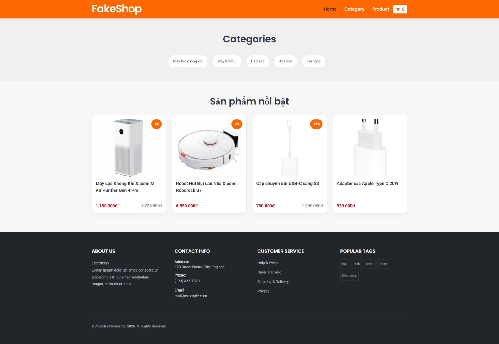
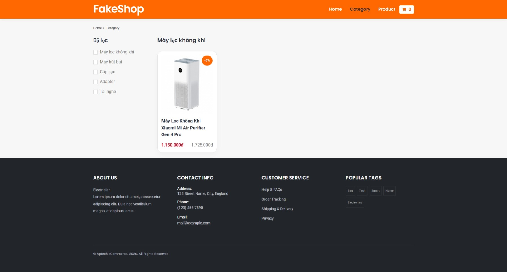
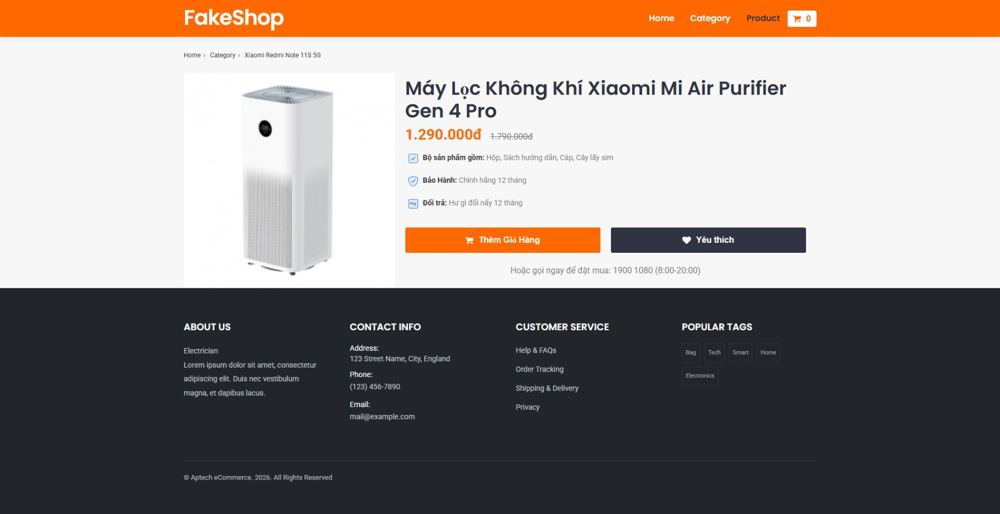

# Test Final React Layout

Hãy tạo một ứng website đơn giản với ReactJS Vite có giao diện giống như hình bên dưới. Giao diện này sẽ có 3 trang: Home, Category, Product. Mỗi trang sẽ có một số nội dung cơ bản để hiển thị.

Cho biết:

- Font chữ: Poppins, Arial, sans-serif
- Màu:

```css
    --main-color: #ff6700;
    --text-color: #7A7A7A;
    --dark-color: #303442;
```

- Footer

```css
    background-color: #222529;
    color: #a8a8a8;
```

## Home Page

- Layout như hình sau



- API:

  - Danh mục: <https://my-json-server.typicode.com/nhannn87dn/ReactJs-Basic-Tutorials/categories>
  - Danh sách sản phẩm: <https://my-json-server.typicode.com/nhannn87dn/ReactJs-Basic-Tutorials/products>

- Yêu cầu sự kiện:
  - Khi click vào danh mục sẽ chuyển sang trang Category Page với URL `/category/:id`. Hiển thị danh sách sản phẩm của danh mục có id đó.
  - Khi click vào sản phẩm sẽ chuyển sang trang Product Page với URL `/product/:id`

## Category Page

- Layout như hình sau



- URL yêu cầu: `/category/:id`
- API: <https://my-json-server.typicode.com/nhannn87dn/ReactJs-Basic-Tutorials/categories/:id>

- Yêu cầu sự kiện:
  - Khi click vào sản phẩm sẽ chuyển sang trang Product Page với URL `/product/:id`
  - Khi click vào danh mục sẽ chuyển sang trang Category Page với URL `/category/:id`. Hiển thị danh sách sản phẩm của danh mục có id đó.

## Product Page

- Layout như hình sau



- URL yêu cầu: `/product/:id`
- API: <https://my-json-server.typicode.com/nhannn87dn/ReactJs-Basic-Tutorials/products/:id>
- Thông tin gì API không có thì code thêm.

## Yêu cầu cấu trúc project

```
public/
src/
├── components/
├── pages/
|   ├── HomePage.tsx
|   ├── CategoryPage.tsx
|   └── ProductPage.tsx
└── App.ts
```

- Thư mục `public` chứa các file ảnh, icon, font chữ.
- Thư mục `components` chứa các component dùng chung.

## Yêu cầu hình thức nộp bài

- Nộp bài bằng cách tạo một repository trên Github và gửi link repo cho giảng viên.
- Deploy website lên Vercel hoặc Netlify và gửi link cho giảng viên.
- Email: <nhannn@softech.vn>
